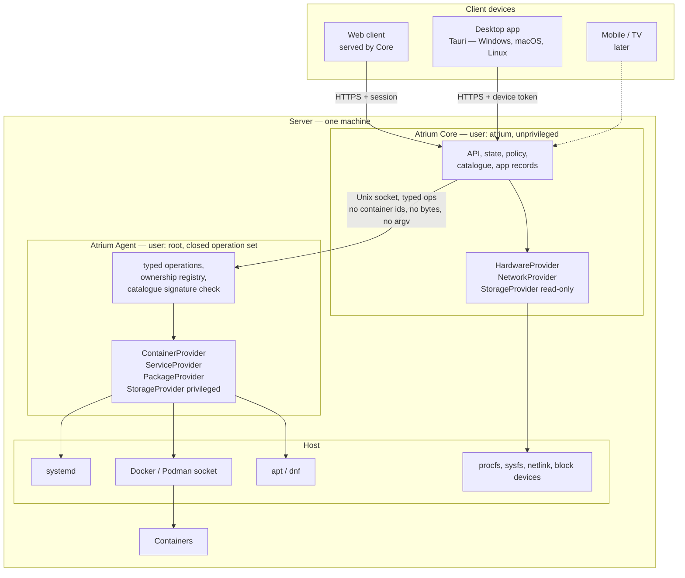
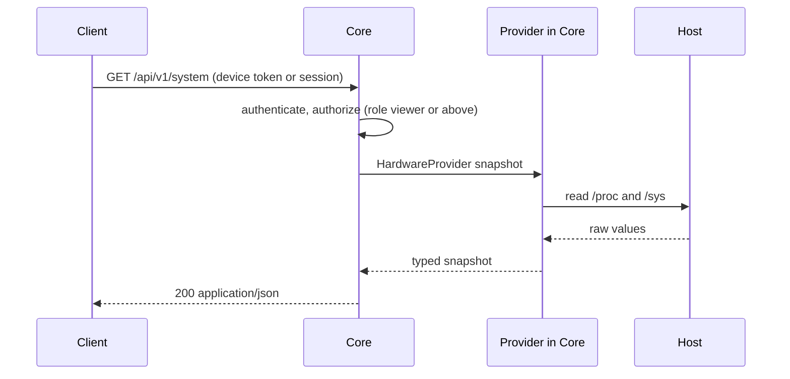
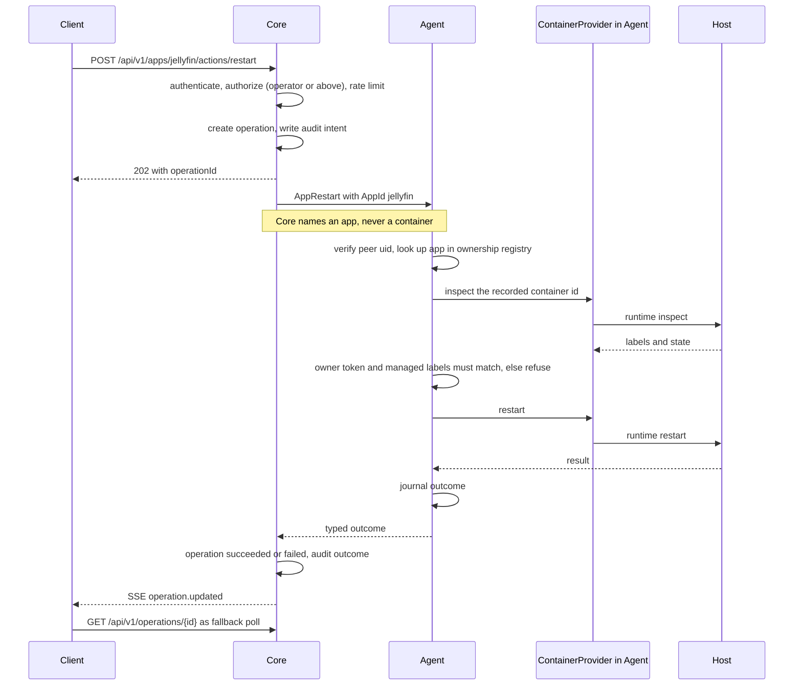
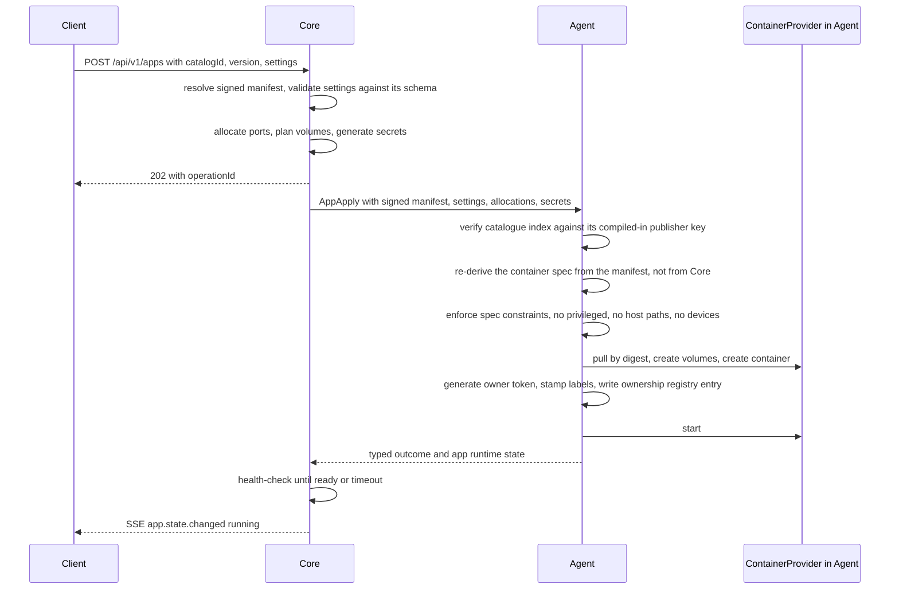

# Atrium — target architecture

Status: target design, revised in the hardening review of 2026-09-22. The
prototype's actual architecture is described in
[`PROTOTYPE-ASSESSMENT.md`](PROTOTYPE-ASSESSMENT.md); the differences between the
two are the work.

Decisions marked **(ADR-nnn)** are frozen and recorded under [`adr/`](adr/README.md).

## 1. Shape of the system

Today the desktop application *is* the product: it holds the configuration, the
credentials, the HTTP clients and the integration logic, and it talks directly to
whatever the user's server happens to be running. That design cannot become a
platform, because a platform has to keep running when no client is open.

The target inverts it. The server holds the product. Clients are views.



Rules that follow from this shape:

- A client never reaches the host. It reaches Core, and Core decides.
- Core never runs as root, never calls `sudo`, and never executes a shell
  **(ADR-004)**.
- **Core has no container-runtime access of any kind** — not the `docker` group,
  not `/var/run/docker.sock`, not a TCP socket, not a socket proxy, not an
  equivalent by any other route. The runtime connection belongs to Agent
  **(ADR-013)**.
- Agent has no network listener, no configuration surface, and no ability to run
  anything that is not in its compiled operation table **(ADR-004)**.
- No component accepts a command string, an opaque byte blob destined for a
  privileged file, or a raw container identifier from any other component.

## 2. Components and responsibilities

### 2.1 Atrium Core

Runs as `atrium:atrium` under systemd. Owns:

- the HTTP API and the bundled web client
- the state store (SQLite) and all configuration
- identity, pairing, sessions, users, roles, audit
- the application *records* — which apps are installed, their settings, their
  allocated ports and volumes, their secrets, their history
- the signed catalogue, and resolution of a user's choices into an install intent
- unprivileged system reads: CPU, memory, load, uptime, network interfaces,
  filesystem capacity
- long-running operations and the event stream
- scheduling: health polling, update checks, backup jobs

Does **not** own: anything requiring privilege, and anything touching the
container runtime. Core's process cannot install a package, write outside its own
tree, stop a system unit, or list a container. It asks.

### 2.2 Atrium Agent

Runs as `root` under systemd, socket-activated on `/run/atrium/agent.sock`
(`0660 root:atrium`). Owns:

- execution of the closed, typed privileged operation set
- **the container runtime connection** — Agent is the only process on the machine
  holding Atrium's access to the Docker/Podman socket **(ADR-013)**
- **the container ownership registry** — Agent's own record of which containers
  Atrium created, in root-only storage Core cannot read or write **(ADR-013)**
- **independent verification of the catalogue signature**, against a publisher
  trust root compiled into Agent that Core cannot supply or replace, and that is a
  different key from this server's device identity **(ADR-016)**. Agent re-derives
  the container specification from the verified manifest rather than trusting a
  specification handed to it **(ADR-014)**
- its own append-only journal, independent of Core's audit log, so a compromised
  Core cannot erase what it asked for

Agent verifies the peer's uid via `SO_PEERCRED` and accepts requests only from
Core's uid. Every operation is a variant of a closed enum with validated, typed
parameters. There is no operation whose parameter is a command, an argv, a shell
fragment, a raw byte payload written to a privileged file, a container id, a
systemd unit outside the platform's namespace, or a path outside a compiled
allowlist.

The prototype's Python power agent is the ancestor of this component and its
safety patterns are carried forward wholesale — fixed argv, no shell, durable
intent before dispatch, dry-run first, boot-identity binding **(ADR-010)**.

### 2.3 Provider layer

Everything that differs between operating systems lives behind a provider trait.
Upper layers — the API, the app engine, the UI — never name a distribution, a
package manager, an init system or a container runtime.

The traits are defined once. **Their implementations live on the side of the
privilege boundary that can actually perform them:**

| Provider | Executes in | Debian/Ubuntu adapter | Later |
| --- | --- | --- | --- |
| `HardwareProvider` | Core | procfs/sysfs/hwmon | vendor sensors |
| `NetworkProvider` | Core | netlink + sysfs | firewall rules, later |
| `StorageProvider` (read) | Core | `statvfs` + mountinfo + sysfs | ZFS/btrfs reporting |
| `StorageProvider` (privileged) | **Agent** | SMART reads, mount application | encryption status |
| `ContainerProvider` | **Agent** | Docker socket | Podman rootful, then rootless |
| `ServiceProvider` | **Agent** | systemd, Atrium units only | OpenRC, Windows services |
| `PackageProvider` | **Agent** | `apt`, compiled allowlist only | `dnf`, `pacman` |

Core holds a thin client for the Agent-side providers. That client speaks the
typed operation protocol; it does not speak Docker, systemd or apt, and it cannot
express an operation the protocol does not define.

**Capability negotiation, not OS sniffing (ADR-002).** Each provider reports what
it can actually do on this host at runtime. `GET /api/v1/system/capabilities` is
the single source of truth for the UI. A feature that is unavailable is
unavailable for a stated reason — "no SMART-capable device found", "container
runtime not installed", "package operations are not enabled in this release" —
not silently missing and not a crash. The UI's `unavailable` state (see
[`UX-STATES.md`](UX-STATES.md)) is driven entirely by this endpoint.

Providers are selected once at startup by a detection pass (os-release, PID 1,
runtime sockets, binaries present) and the selection is recorded in diagnostics.
For Agent-side providers the detection happens in Agent and is reported to Core as
data. Detection failure produces a degraded Core that still serves identity,
pairing and diagnostics — never a Core that refuses to start.

### 2.4 Clients

All clients speak the same public API. There is no privileged client-only
channel and no second API.

- **Web client** — bundled into the Core binary and served by it. This is the
  reference client; anything a native client can do, the web client can do.
- **Desktop app** — the existing Tauri application, reduced to an API client
  **(ADR-009)**. Its shell, tab system, appearance engine, settings surfaces and
  Windows integration are real assets and are kept. Its HTTP integration logic,
  service catalog ownership and credential vault move to Core. What remains
  native is exactly what a browser cannot do: OS keychain storage of the device
  token, background presence, notifications, desktop cards, embedded service
  views with persistent profiles.
- **Mobile / TV** — later, same API.

## 3. Request flows

### 3.1 Ordinary read



Unprivileged reads never touch Agent. Reads that genuinely need privilege — the
container inventory, SMART attributes, an app's logs — are **read-only typed Agent
operations**, bounded and sanitized on the Agent side before they cross back.
There is no third path: a read that is neither unprivileged nor a defined Agent
operation is reported as an unavailable capability.

### 3.2 Privileged mutation



Every mutation is an **operation resource**: created before anything happens,
durable, idempotent by key, observable, and terminal exactly once. A lost response
is never automatically retried by the client; it is resolved by reading the
operation back. This rule comes straight from the prototype's power-control design
and generalizes to everything **(ADR-010)**.

### 3.3 Application install



Rollback is defined at every step: a failed pull leaves nothing, a failed create
removes the partial container and its registry entry, a failed health check leaves
the app installed but `unhealthy` with its logs reachable. Half-installed is never
a resting state.

## 4. Container ownership and the managed boundary

The property being defended: **a fully compromised Core must not be able to
mutate a container Atrium did not create.** Core asserting that a container is
Atrium-managed is not evidence, because a compromised Core will assert anything.

Agent therefore keeps its own evidence, in root-only storage at
`/var/lib/atrium-agent/ownership.json` (`0600 root:root`, atomic replace):

```jsonc
{
  "version": 1,
  "apps": [{
    "appId": "jellyfin",
    "containerId": "sha256:9c1e...",
    "containerName": "atrium-app-jellyfin",
    "ownerToken": "32 random bytes, hex",   // generated by Agent, never leaves Agent
    "runtime": "docker",
    "createdAt": "2026-09-22T18:31:04Z"
  }]
}
```

At creation, Agent generates the owner token, names the container itself
(`atrium-app-<appId>`), and stamps three labels: `io.atrium.managed=true`,
`io.atrium.app=<appId>`, `io.atrium.owner-token=<token>`.

Before **any** mutation, Agent requires all of the following, in this order:

1. The requested `appId` has an entry in Agent's registry. No entry means refuse
   with `not_managed`. Core cannot create an entry except by asking Agent to
   create a container, and Agent refuses to create one whose name already exists.
2. The live container is fetched **by the id in Agent's record**, never by an id
   supplied in the request. The operation protocol has no container-id parameter.
3. The live container's `io.atrium.owner-token` matches the recorded token, in
   constant time, and `io.atrium.app` matches the requested app.
4. The container's creation identity still matches the record, so a recreated or
   id-reused container is not silently inherited.

Any mismatch is refused as `ownership_mismatch`, journaled by Agent, and marks the
app `disowned` — a state the owner must resolve. Agent never repairs it silently.

Why both a registry and labels: a registry alone breaks when a container is
recreated out of band; labels alone are forgeable by anyone with runtime access.
Forging requires the token, which Agent never releases, *and* a registry entry,
which Core cannot write.

**Unmanaged containers are read-only.** Containers the user created belong to the
user (A-16). They appear in the inventory, sanitized — id, name, image reference,
state, published ports, nothing more — and there is **no operation, of any kind,
that mutates them**. Not start, not stop, not restart. A future adoption workflow
is the only way that could change; it is owner-initiated, out of Alpha scope, and
will require the owner's confirmation through a path Agent can verify
independently (ADR-014).

## 5. Identity, pairing and sessions

### 5.1 Server identity **(ADR-003)**

At first start Core generates:

- `server_id` — 128 random bits, stable for the life of the installation, stored
  in `/etc/atrium/identity.json` with mode `0600`.
- a TLS key pair and a self-signed leaf certificate. SANs include the current
  addresses, `atrium-<short-id>.local`, and `localhost`. The certificate is
  reissued automatically when addresses change; **the key pair is not**.

Identity is the key, not the address, not the hostname, not the certificate.
Clients pin the SPKI hash. Re-issuing the certificate for a new address does not
break a paired client. This is the direct answer to the prototype's IP-bound
trust.

### 5.2 Discovery

Core advertises `_atrium._tcp.local` with TXT records carrying `id`, `name`,
`version` and a short SPKI prefix for display. Clients list discovered servers.
Discovery is **advisory**: it can be spoofed, so nothing is trusted because it was
discovered. Manual address entry is equally supported (A-08).

### 5.3 Pairing

A high-entropy pairing secret is generated on the server, displayed by the
installer and re-issuable only from the server console. The client pins the
server's SPKI from the TLS connection, then proves knowledge of the secret with an
HMAC over a transcript that includes that pin; the server proves the same back.
The full construction, its attacker model and every lifecycle rule are specified
in [ADR-003](adr/0003-authentication-and-device-pairing.md) — it is a security
design, not a UI flow, and it is documented there rather than summarized here.

### 5.4 Sessions and tokens

- **Native clients** hold an opaque 256-bit device token in the OS keychain
  (Windows Credential Manager, macOS Keychain, Secret Service). Sent as
  `Authorization: Bearer`. Bound to `deviceId`; revocable individually.
- **Browser clients** exchange the pairing result for an `HttpOnly`, `Secure`,
  `SameSite=Strict` session cookie plus a CSRF token, because a browser cannot
  hold a bearer token safely.
- Every device appears in Settings with name, platform, first seen, last seen and
  a revoke control. Revocation is immediate and takes effect on the next request.

## 6. Persistence

| Data | Location | Owner | Format |
| --- | --- | --- | --- |
| Identity, TLS key | `/etc/atrium/` | Core | JSON + PEM, `0600` |
| State: devices, users, apps, settings, audit, operations | `/var/lib/atrium/atrium.db` | Core | SQLite, WAL |
| Secrets (app credentials, tokens) | `/var/lib/atrium/secrets.db` | Core | SQLite, encrypted with a key in `/etc/atrium/`, `0600` |
| Metric history | `/var/lib/atrium/metrics.db` | Core | SQLite, fixed-size ring |
| Application data | `/var/lib/atrium/appdata/<app>/` by default | Agent creates, container writes | app-defined |
| **Container ownership registry** | `/var/lib/atrium-agent/ownership.json` | **Agent, root-only** | JSON, `0600 root:root` |
| **Agent journal** | `/var/lib/atrium-agent/journal/` | **Agent, root-only** | append-only |
| Logs | journald, plus Core's own rotating file | Core | text |

Core cannot read or write anything under `/var/lib/atrium-agent/`. That separation
is what makes Agent's evidence independent of Core.

Schema migrations are forward-only, numbered, transactional, and run at startup
after an automatic pre-migration backup of the database file. A migration failure
leaves the previous database intact and starts Core in a degraded mode that can
still serve diagnostics and a restore path **(ADR-012)**.

Configuration is state, not files. There is no hand-edited YAML that Core reads at
runtime; `/etc/atrium/core.toml` holds only bootstrap values (listen address, data
directory, log level) that cannot come from the database.

## 7. Configuration and installation

One install command. It adds the repository or fetches a release archive, verifies
its signature, creates the `atrium` system user, installs the Core unit, the Agent
unit and the Agent socket unit, generates identity and TLS material, prints the
pairing secret, and starts Core. It does not touch the firewall, does not modify
existing services, and does not install a container runtime without saying so.

**Alpha installs alongside the prototype, not over it (ADR-015).** Ports, unit
names, users, state directories and the mDNS service type are chosen so that a
machine already running the prototype's agent keeps running it unchanged.

Uninstall reverses exactly what installation did, and asks separately about
application data.

## 8. Application lifecycle

Defined in full in [`APP-SDK.md`](APP-SDK.md). Architecturally:

- An app is a signed manifest plus user settings plus allocated resources (ports,
  volumes, secrets) plus a container Agent created.
- **Agent is the sole writer of app containers**, and the only component that can
  write one at all. Core expresses intent; Agent derives, constrains, applies and
  records.
- Containers the user created are visible and read-only. See §4.
- App state machine: `installing → running ⇄ stopped`, plus `unhealthy`,
  `upgrading`, `failed`, `uninstalling`, `disowned`. Every transition is an
  operation.

## 9. Failure handling

The design rule is that failure is a first-class, typed outcome, never an
exception that reaches the user as a stack trace or a generic banner.

- Every error carries a stable machine `code`, a human `title`, an actionable
  `diagnosis`, and an optional `details` object with the raw underlying evidence
  (exit status, stderr excerpt, provider name, operation id). See
  [`API.md`](API.md#4-error-model).
- The interface shows the diagnosis. The expert opens the details.
- Partial failure is reported as partial, with per-item outcomes, never rolled up
  into a single success or a single failure.
- Core degrades in layers: a broken provider disables its domain, not the product.
  An unreachable Agent disables privileged operations **and the entire container
  domain**, while unprivileged reads keep working. A corrupt database starts a
  recovery mode, not a crash loop.
- Operations that cannot be confirmed (a reboot request whose response was lost)
  remain `unknown` and are reconciled against observed boot identity. They are
  never retried automatically. This is prototype behaviour promoted to a platform
  rule.

## 10. API versioning and compatibility

**(ADR-008)** HTTP/1.1 and HTTP/2, JSON, under `/api/v1`. Within `v1`:

- additive only — new fields, new endpoints, new enum members are allowed
- clients must ignore unknown fields and treat unknown enum members as a defined
  `unknown` case rather than failing
- nothing is removed or repurposed; removal requires `/api/v2` served in parallel
- `GET /api/v1/system/capabilities` lets a client detect features rather than
  guessing from a version number
- every response carries `X-Atrium-Version` (build) and `X-Atrium-Api: 1`

The Core-to-Agent protocol is versioned separately and independently. A Core newer
than its Agent loses the operations that Agent does not implement, reported as
unavailable capabilities; it never falls back to another route, because there is
no other route.

Client/server skew is expected and supported: an older client against a newer Core
loses features, never correctness. A newer client against an older Core is told to
update, by the client, using capability data — not by the server refusing to talk.

## 11. Migration from the prototype

The prototype keeps running and keeps its own document set **(ADR-010)**. The
migration is not a rewrite of the desktop app; it is a relocation of
responsibility.

| Prototype capability | Disposition |
| --- | --- |
| Service catalog (`services.json`, validation, atomic save, recovery) | Moves to Core as "external links". Validation logic ports directly. |
| Credential vault (Windows Credential Manager) | Split: device token stays in the OS keychain; service/app secrets move to Core's secret store. |
| Glances monitoring client | Retired as the metrics source. Glances may remain a linkable service. |
| Homarr discovery | Kept as an optional import source for external links, not a platform dependency. |
| qBittorrent Download Center | Becomes an app integration behind the app platform, post-Alpha. |
| Native service tabs, WebView profiles, TLS policy handling | Kept in the desktop client as-is. Still the right design. |
| Desktop cards, tray, notifications, startup | Kept, re-pointed at Core's API. |
| Appearance engine, theme packs, i18n | Kept unchanged. |
| Python power agent | Superseded by Agent. Its safety patterns are carried forward; the code is not. |
| Root-timer container snapshot exporter | Superseded by Agent's own runtime connection, which is strictly narrower than a root timer running a container CLI. |
| Identifier namespace `personal-hub` | Migrated to `atrium` with a documented, data-preserving migration **(ADR-011)**. |

Existing installations are migrated by the desktop client on first run against a
Core: it offers to import its local service catalog as external links and then
stops being the source of truth. Nothing is deleted from the old location.
