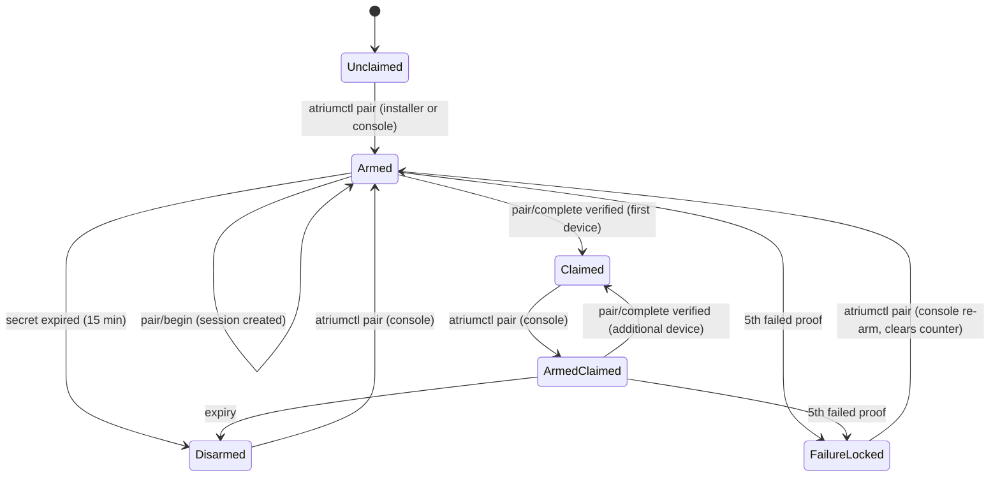

# M1 — implementation plan

Status: plan only. No product code has been written. This document is written so
that the next implementation pass can work through it without inventing
architecture.

**Binding inputs.** [`ROADMAP.md`](ROADMAP.md#m1--acceptance-criteria) criteria
1–48 are binding and are not reinterpreted here. Where a criterion forces a design
decision that is larger than it looks, this plan says so out loud rather than
quietly narrowing it — see §21.

**Scope.** M1 is: Core skeleton, Agent skeleton, server identity, TLS identity,
secure pairing, device registration and revocation, discovery, native system
reads, capability reporting, recovery behaviour, canary coexistence.

**M1 is not:** container mutation, App Center, catalogue, Jellyfin, Docker
management, backups, remote relay, GPU, package management, adoption of unmanaged
containers. Nothing in this plan implements any of them.

---

## 1. Repository layout

### 1.1 What exists, and why it is not disturbed

`src-tauri/` is a **standalone Cargo package, not a workspace member** — its
`Cargo.toml` has no `[workspace]` table, its lockfile is `src-tauri/Cargo.lock`,
and CI keys its cache on that path and builds it on `windows-latest`. It also
cannot build on Linux: `tauri` needs WebKitGTK development packages that the
Linux runners do not have.

Therefore **M1 does not create a root Cargo workspace.** A root workspace would
move the target directory and lockfile, break the CI cache key, and drag the
Windows-only desktop crate into every Linux build. Instead M1 adds a **second,
independent Cargo workspace** under `server/`.

| Path | Disposition in M1 |
| --- | --- |
| `src-tauri/` | Stays. One new module and one new path dependency (§14). Everything else untouched. |
| `src/` (React) | Stays. One new feature module (§14). |
| `tests/` (node) | Stays. Untouched. |
| `server-agent/` (Python prototype agent) | **Completely untouched.** It is the other half of the canary and keeps running (ADR-015). |
| `public/`, `config/`, `docs/` | Untouched except this plan and the test plan. |
| `.github/workflows/ci.yml` | Gains one job (§1.3). Existing jobs unchanged. |

### 1.2 New layout

```
server/                                   # second Cargo workspace, Linux-targeted
  Cargo.toml                              # [workspace] members = ["crates/*"]
  Cargo.lock
  rust-toolchain.toml                     # channel = "stable" (pinned minor at M1A)
  deny.toml                               # cargo-deny: licences, advisories, bans
  crates/
    atrium-protocol/                      # Core <-> Agent wire types, framing, versioning
      src/{lib,frame,version,ops,error}.rs
    atrium-pairing/                        # secret codec + transcript + proofs (no I/O)
      src/{lib,secret,transcript,proof}.rs
    atrium-api-types/                      # HTTP DTOs, error codes, capability shapes
      src/{lib,system,network,storage,capability,device,pairing,problem}.rs
    atrium-core/                           # the Core binary
      src/{main,config,identity,tls,http/*,auth,pairing,devices,db/*,providers/*,
           agentclient,discovery,capability,diagnostics,audit,recovery}.rs
    atrium-agent/                          # the Agent binary
      src/{main,listener,peer,journal,ops/*,selfcheck,runtime_probe}.rs
    atrium-client/                         # native client: pinning, pairing, typed calls
      src/{lib,pin,pair,transport,api}.rs  # cross-platform: builds on Windows
    atriumctl/                             # console CLI (root)
      src/{main,cmd/*}.rs
  packaging/
    systemd/atrium-core.service
    systemd/atrium-agent.service
    systemd/atrium-agent.socket
    install.sh
    uninstall.sh
    atrium-core.toml.example
  tests/                                   # workspace integration tests needing a host
    protocol_boundary.rs  pairing_flow.rs  privilege_boundary.rs  recovery.rs
  xtask/                                   # optional; only if a task runner is needed
```

Crate boundaries are security boundaries and are enforced by `deny.toml` bans and
a dependency test (§18.3):

- `atrium-core` **must not** depend on `atrium-agent`.
- `atrium-client` **must not** depend on `atrium-core`, `atrium-agent` or
  `rusqlite` — it must stay buildable on Windows.
- `atrium-agent` **must not** depend on `axum`, `rustls`, `rusqlite`, or any HTTP
  or TLS crate.
- `atrium-protocol` and `atrium-api-types` **must not** depend on `tokio`,
  `axum` or any I/O crate — they are types and codecs only.

### 1.2a Re-review of the two-workspace decision

Re-examined during the final planning pass, against the question "is this
structure right, or merely tidy".

| Requirement | Status |
| --- | --- |
| `src-tauri/Cargo.lock` and the Windows CI job untouched | **Yes.** No root workspace is created, the Tauri package keeps its own lockfile and target directory, and the existing `rust` job's `--manifest-path src-tauri/Cargo.toml` and cache key are unchanged |
| `server/` has its own workspace and lockfile | **Yes**, `server/Cargo.toml` + `server/Cargo.lock` |
| No Linux/server-only dependency reaches the Windows desktop build | **Enforced, not hoped.** `src-tauri` gains exactly one path dependency, `atrium-client`, whose allowed set is tokio, rustls/tokio-rustls, hyper, x509-parser, serde, `atrium-pairing`, `atrium-api-types`, `mdns-sd` — all platform-neutral. `nix`, `rusqlite`, `axum` and `clap` are **banned** from it by `deny.toml` and by the CI boundary check |
| Forbidden-dependency rules mechanically testable | **Yes** — `server/ci/boundary-checks.sh` plus `cargo deny` bans; §18.3 |
| Future extraction into another repository | **Not assumed and not designed for.** The two workspaces sit in one repository and share a git history deliberately; the only cross-boundary edge is one path dependency, which would be the thing to revisit *if* extraction ever happened |

**Can seven crates be fewer?** Only by merging a boundary, so no. Each pair that
looks mergeable is load-bearing: `atrium-api-types` cannot fold into
`atrium-client`, because Core needs the types and must not depend on the client;
`atrium-protocol` cannot fold into `atrium-api-types`, because that would pull
HTTP DTOs into Agent; `atrium-pairing` stays separate so the constant-time
comparison and the secret codec live somewhere small enough to read in one
sitting; and `atriumctl` stays a separate binary because it holds
`rotate-identity` and `restore` — keeping it out of Core means the Core binary
contains no code that can replace the identity key or overwrite the database,
which is the same invariant §4.2 enforces with file ownership. Merging any of
them would trade a reviewable boundary for a smaller crate count.

### 1.3 CI

One new job, `server`, on `ubuntu-latest`, mirroring the existing `rust` job's
shape:

```
cargo fmt   --manifest-path server/Cargo.toml --check
cargo clippy --manifest-path server/Cargo.toml --all-targets -- -D warnings
cargo test  --manifest-path server/Cargo.toml
cargo deny  --manifest-path server/Cargo.toml check
bash server/ci/boundary-checks.sh        # §18.3 grep/dependency gates
```

The existing Windows `rust` job now also compiles `atrium-client` (path
dependency). That crate is deliberately dependency-light and platform-neutral so
this does not slow the Windows job meaningfully.

**CI changes are specified here and not made in this pass.**

---

## 2. Component responsibilities

### 2.1 Atrium Core — `server/crates/atrium-core`

| Property | Value |
| --- | --- |
| Responsibility | HTTP API over TLS, server identity, pairing, devices, native system reads, capability aggregation, discovery advertisement, audit, diagnostics, recovery mode |
| Privilege | **Unprivileged.** `User=atrium`, `NoNewPrivileges=true`, empty capability bounding set, **`SupplementaryGroups=` empty** |
| Process identity | uid/gid of the `atrium` system user |
| Allowed dependencies | tokio, axum/hyper, rustls/tokio-rustls, rcgen, rusqlite, mdns-sd, nix, serde, tracing, the three shared crates |
| Forbidden dependencies | any container runtime client (bollard, docker-api, shiplift, podman-*), any process-spawning helper, `atrium-agent` |
| Owned state | `/var/lib/atrium/atrium.db`, `/var/lib/atrium/tls.crt`, `/var/lib/atrium/identity-state.json`, `/var/lib/atrium/backups/`. It **reads** `/etc/atrium/` and can write nothing there |
| Boundaries | **North:** HTTPS `/api/v1` to clients. **South:** the typed Unix-socket protocol to Agent, and read-only `/proc`, `/sys`, `statvfs`, `getifaddrs` |

Core **never** spawns a process in M1. There is no `std::process::Command` call
site in `atrium-core`; this is enforced by a grep gate (criterion 47).

### 2.2 Atrium Agent — `server/crates/atrium-agent`

| Property | Value |
| --- | --- |
| Responsibility | Serve the typed protocol on `/run/atrium/agent.sock`; verify peer credentials; journal every request; report its own state and probe for a container runtime |
| Privilege | root, **with an empty capability bounding set** — M1 has no privileged *action*, so Agent needs no capability at all. M2 adds exactly what it needs, with review |
| Process identity | uid 0 |
| Allowed dependencies | tokio (net/io/rt/signal/time/fs), serde, serde_json, thiserror, tracing, `atrium-protocol` |
| Forbidden dependencies | axum, hyper, rustls, rusqlite, clap, any HTTP or TLS crate, any container runtime client |
| Owned state | `/var/lib/atrium-agent/` (`0700 root:root`) — `journal/*.jsonl` only in M1. `ownership.json` is created by M2, not M1 |
| Boundaries | **North:** the typed protocol, Core's uid only. **South:** in M1, a passive `lstat()` of the known container runtime sockets (never `connect()` — decided before M1D) and reads of its own state |

**M1's Agent operation table contains no mutating operation of any kind.** That is
a property worth stating in the code, in the tests and in the release notes.

### 2.3 Shared crates

| Crate | Responsibility | Depended on by |
| --- | --- | --- |
| `atrium-protocol` | Core↔Agent envelope, framing, protocol version constant, the operation enum, the error enum | core, agent |
| `atrium-pairing` | Crockford Base32 codec with canonicality rules, transcript construction, HKDF/HMAC proofs, constant-time comparison | core, client, atriumctl |
| `atrium-api-types` | HTTP DTOs, the error-code enum, capability and reason-code enums | core, client |

None of the three performs I/O, opens a file, or takes a path. They are pure
types and codecs, which is what makes them testable exhaustively.

### 2.4 Web / reference client

**Not in M1.** The reference web client is M4. Core serves a single static
placeholder page at `/` stating that Core is running and the interface arrives
later, plus `/healthz`. No bundled SPA, no asset pipeline.

### 2.5 Tauri desktop integration

See §14. Scope is: a new Rust module (`src-tauri/src/atrium_server.rs`), a new
path dependency on `atrium-client`, a new React feature module, and a Settings
panel. Nothing existing is rewritten, and no existing integration is re-pointed.

### 2.6 Installer and systemd assets

`server/packaging/`. Shell + unit files only; see §11 and §12.

---

## 3. Core ↔ Agent protocol

### 3.1 Transport

- Unix `SOCK_STREAM` at `/run/atrium/agent.sock`, created by
  `atrium-agent.socket` with `SocketMode=0660`, `SocketUser=root`,
  `SocketGroup=atrium`.
- Agent obtains the listener by **socket activation** (`LISTEN_FDS`/`LISTEN_PID`,
  parsed in ~40 lines, no crate — ADR-007) and also runs at boot (§11.3), so the
  socket exists before Agent starts and `systemctl status atrium-agent` shows
  active (criterion 3).
- On accept, Agent calls `UnixStream::peer_cred()` (tokio built-in) and **rejects
  any uid that is not Core's** — resolved from the `atrium` user at startup, once,
  and cached. Rejection closes the connection after journaling the attempt
  (criterion 8).
- One request/response per connection in M1. No multiplexing, no pipelining,
  no keep-alive. Simplicity here is a security property.

### 3.2 Framing

`u32` big-endian length prefix, then a UTF-8 JSON object. Maximum frame
**64 KiB**, checked before allocation. A frame larger than the maximum closes the
connection without parsing. JSON is parsed with `serde` and
`#[serde(deny_unknown_fields)]` on every type.

Why JSON and not a binary codec: the whole protocol is three message types and
must be auditable by reading a journal line. Performance is irrelevant at this
volume.

### 3.3 Versioning, separate from the HTTP API

```rust
pub const AGENT_PROTOCOL_VERSION: u32 = 1;   // independent of X-Atrium-Api
```

Handshake, before any operation:

```jsonc
// Core -> Agent
{"hello":{"protocol":1,"core_version":"0.1.0","request_id":"<16 hex>"}}
// Agent -> Core, on match
{"hello_ok":{"protocol":1,"agent_version":"0.1.0"}}
// Agent -> Core, on mismatch
{"error":{"code":"protocol_version_mismatch","agent_protocol":1}}
```

**Fail closed:** on any mismatch Agent journals and closes; Core marks the
privileged capability `available: false` with reason
`agent_protocol_mismatch` and **does not attempt any alternative path**. There is
no negotiation, no downgrade, and no "best effort" mode.

### 3.4 The M1 operation table — complete

```rust
#[derive(Deserialize)]
#[serde(deny_unknown_fields, rename_all = "snake_case")]
pub enum AgentOp {
    /// Agent's own identity and state. No parameters.
    AgentInfo,
    /// Read-only probe for a container runtime socket. No parameters.
    RuntimeProbe,
}
```

**Two variants. Neither takes a parameter.** That is not a simplification of the
architecture; it is the correct M1 surface, because M1 performs no privileged
action. Criterion 38's enumeration test passes trivially and will keep passing
only if every future variant is added deliberately.

Responses:

```jsonc
// AgentInfo
{"agent_info":{
  "agent_version":"0.1.0","protocol":1,
  "uid":0,"pid":1234,"started_at":"2026-09-22T18:00:00Z",
  "boot_id":"<uuid from /proc/sys/kernel/random/boot_id>",
  "state_dir":{"path":"/var/lib/atrium-agent","mode":"0700","uid":0,"gid":0},
  "journal":{"writable":true,"entries":41},
  "capability_bounding_set_empty":true,
  "no_new_privileges":true}}

// RuntimeProbe
{"runtime_probe":{
  "runtime":"docker",                    // "docker" | "podman" | null
  "socket":"/var/run/docker.sock",       // or null
  "reachable":true,                      // Agent connect() succeeded, then closed
  "version":null,                        // M1 does not query the runtime API
  "version_reason":"runtime_version_probe_not_in_m1"}}
```

**The probe takes no path.** Agent's candidate socket paths, `/var/run/docker.sock`,
`/run/docker.sock` and `/run/podman/podman.sock`, are a compiled-in constant list.
Core cannot name a socket, so it cannot make a root process connect to a socket of
its choosing. Agent connects, confirms the peer is a socket, and closes without
sending a byte.

**Agent validates Core's `request_id` before journaling it.** It must match
`[0-9a-f]` repeated 1 to 64 times or the frame is rejected. Agent does not trust
Core for anything, including the shape of a correlation string it is about to
write into its own append-only file.

**Scope note, stated rather than assumed.** Criterion 39 requires that the
container capability be reported *through Agent* with `"via":"agent"`. It does
not require a runtime version. M1's probe therefore checks only that the socket
exists, is a socket, and accepts a connection from Agent — it sends no bytes and
links no runtime client. `version` is `null` with an explicit reason. This
satisfies criterion 39 exactly and adds no runtime client anywhere.

> **Amended before M1D: the probe is passive.** Connecting, even without
> sending a byte, wakes a socket-activated Docker or Podman, and Atrium must
> not start a stopped runtime because someone looked at a status page. The
> probe now `lstat`s the candidates and **never connects**. It reports
> presence only: `reachable` is removed, `liveness` is always `null` with
> `liveness_reason: "passive_probe_in_m1"`, and the socket is named by
> candidate rather than by path (M1C *As built* 3). Criterion 39 is still met:
> the capability is reported through Agent. Whether a runtime is running
> becomes known only when a later milestone performs an explicit, authorized
> container action. The example above is kept as it was planned.

### 3.5 What the protocol may never contain

Enforced by the type system, by `deny_unknown_fields`, and by the enumeration
test in §18.3:

- no command, argv, shell fragment, or executable path
- no container identifier
- no arbitrary `String`, `PathBuf` or `Vec<u8>` parameter
- no public key, key identifier, key path, or trust-root file
- no flag that skips, relaxes or reconfigures verification of anything
- no unit name, package name, or host path

Every future parameter must be a **newtype with a private constructor that can
only be built from a validated source**. The test in §18.3 fails the build on a
bare `String`/`PathBuf`/`Vec<u8>` field anywhere in `AgentOp`.

### 3.6 Journaling and correlation

Agent appends one line to `/var/lib/atrium-agent/journal/<date>.jsonl` per
connection, whatever the outcome:

```jsonc
{"seq":1041,"ts":"2026-09-22T18:31:04.221Z","peer":{"uid":1001,"gid":1001,"pid":8123},
 "accepted":true,"request_id":"3f1c…","op":"agent_info","outcome":"ok","duration_ms":2}
```

`seq` is Agent's own monotonic counter and `ts` is Agent's own clock; `request_id`
is Core-supplied and is treated as a correlation hint, never as evidence. A
rejected peer, a malformed frame and a version mismatch each produce a line with
`accepted:false` and a reason. Rotation: 5 files × 8 MiB, oldest discarded.

Core writes a matching `audit` row per call (§15). Criterion 33 is tested by
correlating the two, as root.

---

## 4. Persistent state

### 4.1 What M1 creates, and what it deliberately does not

ADR-012 defines three databases for the platform. **M1 creates one.**
`secrets.db` has nothing to store until M3, and `metrics.db` has nothing to store
because M1 serves current metrics only and has no history endpoint. The
separation ADR-012 requires is preserved: the other two are created by the passes
that first need them, at the paths ADR-012 names.

### 4.2 Layout

**The security review of this plan changed this table.** In the first draft
`/etc/atrium/` was writable by Core so that it could generate and reissue material
there. That made a compromised Core able to overwrite or destroy the private key:
a denial of service that forces every device to re-pair, and an identity change
nobody asked for. The directory is now **root-owned and read-only to Core at
runtime**; generation happens once during installation, in a separate short-lived
invocation (5.1, 12.2), and the only file reissue rewrites is the public
certificate, which lives in the writable state directory.

| Path | Owner | Mode | Core may write | Contents |
| --- | --- | --- | --- | --- |
| `/etc/atrium/` | `root:atrium` | `0750` | **no** | identity material. Group `atrium` gets `r-x`: traverse and list, **no write bit**, so Core cannot create, unlink or rename anything here |
| `/etc/atrium/identity.json` | `root:atrium` | `0640` | **no** | `server_id`, created_at, key fingerprint — immutable after first boot |
| `/etc/atrium/tls.key` | `root:atrium` | `0640` | **no** | PKCS#8 DER, ECDSA P-256 — Core reads it to serve TLS and cannot replace it |
| `/etc/atrium/secrets.key` | `root:atrium` | `0640` | **no** | 32 random bytes; **generated in M1, used from M3** |
| `/etc/atrium/core.toml` | `root:atrium` | `0640` | **no** | bootstrap config: listen address, data dir, log level, server name |
| `/var/lib/atrium/` | `atrium:atrium` | `0700` | yes | Core state |
| `/var/lib/atrium/tls.crt` | `atrium:atrium` | `0644` | yes | self-signed leaf, PEM — public, reissued on address change |
| `/var/lib/atrium/identity-state.json` | `atrium:atrium` | `0600` | yes | current SAN set, certificate serial and issue time |
| `/var/lib/atrium/atrium.db` | `atrium:atrium` | `0600` | yes | SQLite, WAL |
| `/var/lib/atrium/backups/` | `atrium:atrium` | `0700` | yes | pre-migration database copies |
| `/var/lib/atrium-agent/` | `root:root` | `0700` | no — unreadable | Agent state (criterion 41) |
| `/var/lib/atrium-agent/journal/` | `root:root` | `0700` | no — unreadable | append-only JSONL |
| `/run/atrium/agent.sock` | `root:atrium` | `0660` | connect only | created by the socket unit |

`secrets.key` exists in M1 because criterion 6 names it. It is generated with the
rest of the identity material and is not read by any M1 code path. This is stated
here so nobody later mistakes it for dead code and deletes it.

**The identity key is not writable by the service identity, and that is enforced
by ownership rather than by systemd.** `/etc/atrium/` is `root:atrium 0750`: the
owner is root, the group is `atrium`, and the group bits are `r-x` — traverse and
list, with **no write bit**, so Core cannot create, rename or unlink anything in
the directory. The three files inside are `root:atrium 0640`, so Core can read
them and cannot write them, and cannot `chmod` or `chown` them because it does
not own them.

A `root:root 0750` directory would have been wrong and an earlier draft said so:
with no group match, the `atrium` user has no execute bit on the directory, cannot
traverse it, and therefore cannot open `tls.key` at all — the service would fail
to serve TLS. The group must be `atrium` for the read to work; the missing write
bit is what makes the write fail. `ReadOnlyPaths=/etc/atrium` in the unit is defence in depth on top of that,
not the mechanism — a unit file is one edit away from being wrong, and
discretionary access control is not.

The invariant, stated so a test can be written against it: **arbitrary code
execution as `atrium` must not be sufficient to replace the server identity key.**
Criterion 6 was amended to require proving it by attempted write, not only by
`stat`.

Criterion 6 names `/etc/atrium/tls.key`, the identity file and the secrets key,
and all three are exactly where it requires, with ownership stronger than the
original wording. The certificate is public
material and is not named by the criterion; moving it into the state directory is
what lets `/etc/atrium/` be read-only. ARCHITECTURE section 6 groups it loosely
with the key and should be updated to match when M1B lands.

`core.toml` is root-owned in a root-owned directory, so Core cannot replace it.
Core additionally **validates** it: `data_dir` must resolve under
`/var/lib/atrium`, and `listen` must name a port above 1024. A configuration that
fails validation is a startup failure, not a silently adjusted default.

### 4.3 Schema (migration 1)

```sql
PRAGMA journal_mode = WAL;
PRAGMA synchronous  = NORMAL;
PRAGMA foreign_keys = ON;

CREATE TABLE devices (
  device_id     TEXT PRIMARY KEY,          -- 16 random bytes, lowercase hex
  name          TEXT NOT NULL,
  platform      TEXT NOT NULL,             -- closed enum: windows|macos|linux|web|other
  role          TEXT NOT NULL,             -- M1: always 'owner'
  token_digest  BLOB NOT NULL UNIQUE,      -- SHA-256(token), 32 bytes, the whole verifier
  created_at    TEXT NOT NULL,
  last_seen_at  TEXT
);

CREATE TABLE pairing_state (
  id            INTEGER PRIMARY KEY CHECK (id = 1),
  claimed       INTEGER NOT NULL DEFAULT 0,
  armed         INTEGER NOT NULL DEFAULT 0,
  secret_digest BLOB,                      -- SHA-256 of the decoded 16 bytes
  armed_at      TEXT,
  expires_at    TEXT,
  failures      INTEGER NOT NULL DEFAULT 0,
  locked        INTEGER NOT NULL DEFAULT 0
);

CREATE TABLE audit (
  id            INTEGER PRIMARY KEY AUTOINCREMENT,
  ts            TEXT NOT NULL,
  request_id    TEXT,
  actor_device  TEXT,                      -- NULL for console/system actions
  actor_role    TEXT,
  action        TEXT NOT NULL,             -- closed enum
  target        TEXT,
  outcome       TEXT NOT NULL,             -- ok | failed | refused
  error_code    TEXT,
  detail        TEXT                       -- JSON, redacted by construction
);

CREATE TABLE settings (
  key           TEXT PRIMARY KEY,
  value         TEXT NOT NULL
);
```

`token_digest` is `SHA-256(token)` and is the entire verifier — there is no
second hash and no password-hashing step. See §7.3 for why. The same applies to
`secret_digest`: the pairing secret is 128 bits from the CSPRNG, so a slow hash
would protect nothing and would hand an unauthenticated caller a CPU cost.

### 4.4 Migrations

- `PRAGMA user_version` holds the applied schema number. M1 ships version 1.
- Before applying any migration, Core copies the database with `VACUUM INTO`
  to `/var/lib/atrium/backups/atrium.db.pre-<n>-<timestamp>` (with `.<k>`,
  1–99, appended when that name is already taken within the same second, as
  when a restored older backup migrates again). A copy that cannot
  be made (no disk space) **aborts the migration** and enters recovery mode; it
  never migrates without a backup.
- Each migration runs in one transaction. A failure rolls back, leaves the
  previous database intact, and enters recovery mode.
- Forward only. A rollback of a release restores the pre-migration copy, which is
  why the copy exists.
- Backups are pruned to the newest 5.

### 4.5 Corruption behaviour

At startup Core runs `PRAGMA integrity_check` (and catches an open failure). On
anything other than `ok`:

1. Do **not** delete, truncate, rebuild or "repair" the database.
2. Log `state_database_unreadable` with the raw SQLite message in the log (not in
   any API response).
3. Enter recovery mode (§4.6). Do not exit non-zero, so systemd does not
   crash-loop (criterion 30).

### 4.6 Recovery mode

When the primary state database is unreadable, the component that knows who may
do anything is the component that is broken. Recovery mode answers that by
**reporting and refusing**, not by finding a second way to authenticate.

**There is no authentication mirror.** An earlier draft proposed one — a copy of
the device verifiers outside the database — so that an owner could restore
remotely. It is removed. A duplicate of the most security-sensitive state in the
product is a consistency bug waiting for the worst possible moment: a revocation
that lands in one store and not the other is a revoked device that still works,
discovered during an incident. The alternative, an unauthenticated remote
restore, would let anyone on the LAN roll the server back to an older state.
Neither is worth avoiding a terminal on a day the machine is already broken.

**Recovery mode serves no state-changing route at all.**

| Route | Auth | Behaviour |
| --- | --- | --- |
| `GET /healthz` | none | `{"state":"recovery","reason":"state_database_unreadable","since":"…"}` |
| `GET /api/v1/system/diagnostics` | none, **heavily redacted** | provider selection, component versions, the failure's error code, schema version, whether backups exist and how many. No hostname, no addresses, no device data, no audit content |
| everything else, including all of `/api/v1/pair/*` | — | `503 internal.recovery_mode` |

The diagnostics route is unauthenticated in recovery **only because it cannot be
authenticated**, and it is therefore cut down to what is safe to hand an
unauthenticated LAN caller: enough to tell the owner what is wrong, nothing that
identifies the machine or its users. A test asserts the recovery payload against
a literal allowlist of fields.

**Recovery mode cannot widen authority**, and the test suite states this as a set
of negatives: the recovery router is a strict subset of the normal router; no
route in it mutates anything; `/api/v1/pair/*` is absent; and **Core does not
open the Agent socket at all while in recovery** — the Agent client is not
constructed, so there is no code path to reach it.

**Restore is a local console action.**

```
atriumctl restore --list                 # backups, timestamps, sizes, schema versions
atriumctl restore --from <backup>        # requires typing the server name to confirm
```

`atriumctl` runs as root, drops to `atrium` before touching SQLite (so it cannot
leave root-owned WAL files), moves the corrupt database aside rather than
deleting it, installs the chosen backup, writes an audit row, and restarts Core.
Normal service resumes with previously paired devices still working, because
their verifiers were in the restored database.

**This is a deliberate exception to the product's no-terminal goal**, and it is
written down here and in `SECURITY.md` §19 rather than discovered later.
Catastrophic database corruption is not normal product usage; it is the one
moment where physical or administrative access to the machine is the right
authority, and requiring it removes an entire remote attack surface that would
otherwise exist only for this rare case.

---

## 5. Server identity lifecycle

### 5.1 Generation, once

Identity is generated **once, during installation**, by a separate invocation:
`atrium-core init-identity`, run as the `atrium` user while `/etc/atrium/` is
still writable, after which the installer locks the directory (12.2). The
long-running Core process never has permission to create, replace or delete
identity material. If the files are absent when Core starts, it enters recovery
mode with `identity.missing` rather than generating them, because a running Core
that can mint an identity is a running Core that can destroy one.

`init-identity` does, in order:

1. `server_id` = 16 bytes from `getrandom`, stored lowercase hex (32 chars).
   `short_id` = the first 8 hex characters.
2. Device identity key = **ECDSA P-256**, generated by `rcgen`, written as PKCS#8
   DER to `tls.key` (`0600`).
   *Why P-256 and not Ed25519:* browsers are the reference client (M4), and
   Ed25519 certificates are not accepted by mainstream browser TLS stacks. The
   catalogue publisher key (ADR-016) is a different key and will be Ed25519; the
   two choices are independent because the two keys are independent.
3. `secrets.key` = 32 bytes from `getrandom` (`0600`), unused until M3.
4. `identity.json` written last, atomically, as the marker that generation
   completed.
5. Certificate issued per 5.2, written to `/var/lib/atrium/tls.crt`.
6. Exit. The installer then chowns `/etc/atrium/` to `root:atrium` and chmods it
   to `0750`.

### 5.2 Certificate

- Self-signed leaf, `CN = Atrium <short_id>`, validity 397 days.
- SANs: `DNS:atrium-<short_id>.local`, `DNS:localhost`, `IP:127.0.0.1`, `IP:::1`,
  plus **every** current non-loopback IPv4 and IPv6 address on every interface.
  Nothing anywhere assumes one address.
- `keyUsage = digitalSignature`, `extendedKeyUsage = serverAuth`.
- Written to `/var/lib/atrium/tls.crt`; the SAN set, serial and issue time are
  recorded in `/var/lib/atrium/identity-state.json`. `identity.json` in `/etc`
  holds only immutable facts and is never rewritten.

### 5.3 Reissue

Core polls the interface set every 30 seconds (adequate for M1; netlink
monitoring is a later optimisation and is not needed to satisfy any criterion).
If the address set differs from the set the current certificate names
(recorded in `/var/lib/atrium/identity-state.json`), or the certificate is
within 30 days of expiry:

1. Issue a new certificate **with the existing key pair**, which Core reads but
   cannot modify.
2. Swap it into the running rustls configuration without restarting.
3. Update `identity-state.json`; write an audit row
   `identity.certificate_reissued`.
4. Re-announce over mDNS (§10).

**Why pins survive (criteria 7 and 18).** A client pins
`SHA-256(SubjectPublicKeyInfo)`. The SPKI is a property of the key pair, not of
the certificate. Reissue changes the certificate's serial, validity and SAN set,
and leaves the SPKI byte-identical. A paired client therefore sees the same pin,
validates it, and reconnects with no warning. The test is mechanical: capture the
SPKI hash before and after an address change and assert equality (§ test plan).

### 5.4 Hostname and address changes

A hostname change affects the mDNS instance name and nothing else — identity does
not derive from it. An address change triggers §5.3. Losing all addresses leaves
the certificate as-is and reports `network` capability degraded; it does not
regenerate anything.

### 5.5 Deliberate rotation

`atriumctl rotate-identity` (root, console, requires typing the server's name).
It is the **only** thing that can replace the key, and it is reachable neither
from the network nor from Core:

1. Generate a new key pair and certificate, writing them as root.
   **`server_id` does not change** - it identifies the installation, not the key.
2. Revoke every device and disarm pairing.
3. Arm a fresh pairing secret and print it.
4. Audit `identity.key_rotated`.

Clients then see the same `server_id` with a different SPKI, which is
indistinguishable from an impersonation attempt and is therefore treated as one:
the client shows `untrusted` and refuses to proceed. Re-pairing requires the
console secret. Criterion 19's "presents that as a deliberate action rather than
as an attack" is met by **copy, not by cryptography**, and the copy is honest:

> This server's identity key has changed. That happens when the key is
> deliberately rotated — and also if something is impersonating the server.
> Re-pair only with a code you read from the server's own console.

### 5.6 Recovery when identity is inconsistent

If some identity files exist and others do not — key without `identity.json`,
`identity.json` without key — Core **fails closed into recovery mode** with
`identity.inconsistent`. It does not regenerate. Silently regenerating would
change the server's identity and break every pin, which is exactly the outcome an
attacker would want and a user would not understand.

---

## 6. Pairing state machine

### 6.1 Server states



`Disarmed` in a claimed server is the steady state: **a claimed server with no
armed secret refuses every pairing attempt**, which is criterion 17's second
sentence.

### 6.2 Session states (per attempt)

`None → Begun → (Completed | Expired | Failed)`. A session holds: `pairing_id`
(16 random bytes hex), `server_nonce` (32 bytes), `client_nonce` (32 bytes),
`device_info_hash`, `created_at`, `connection_id`, and the exporter captured from
that connection. Sessions live in memory only, capped at 4 concurrent, evicted
oldest-first.

### 6.3 The secret — exactly as ADR-003 §3

- **16 bytes** from `getrandom`; 128 bits.
- Encoded as **26 Crockford Base32 symbols**; the final symbol's two low bits are
  padding and must be zero.
- Displayed `XXXX-XXXX-XXXX-XXXX-XXXX-XXXX-XX`; hyphens carry no entropy.
- Decode: strip whitespace and `-`; **ASCII-only uppercase** (never
  `str::to_uppercase` on a locale-dependent path — Rust's is locale-independent,
  but the client also has JavaScript and C# paths where it is not, so the rule is
  stated and tested under `tr_TR.UTF-8`); map `O→0`, `I→1`, `L→1`; reject anything
  outside `0123456789ABCDEFGHJKMNPQRSTVWXYZ`; require exactly 26 symbols; reject
  non-canonical padding; produce exactly 16 bytes.
- QR payload = the canonical 26 symbols, no hyphens. M1 defines the payload and
  tests that it decodes identically; it does not render a QR image and adds no QR
  dependency.
- Stored only as `SHA-256` of the decoded bytes in `pairing_state.secret_digest`,
  compared in constant time. Never logged,
  never in an audit `detail`, never returned.
- Lifetime 15 minutes; `begin`→`complete` window 2 minutes; single use, consumed
  in the same transaction that inserts the device.
- Comparison is on the decoded 16 bytes with `subtle::ConstantTimeEq`.

### 6.4 The exchange

```
cb   = TLS-Exporter("EXPORTER-Atrium-Pairing-v1", "", 32)     // of the COMPLETE connection
K    = HKDF-SHA256(ikm = secret16, salt = server_nonce,
                   info = "atrium-pair-v1" || server_id, len = 32)
T    = server_id(16) || spki(32) || cb(32) || client_nonce(32) || server_nonce(32)
       || sha256(device_name || 0x00 || platform)(32)
proofC = HMAC-SHA256(K, "atrium-pair-v1:client" || T)
proofS = HMAC-SHA256(K, "atrium-pair-v1:server" || T)
```

Every field is fixed-length, so the transcript cannot be made ambiguous.

### 6.4a Binding profile — and why the browser is not a dead end

`cb` and `spki` are readable by a native client and by nothing that runs in a
browser page: JavaScript has no access to a TLS exporter or to the peer
certificate. The transcript therefore names its binding profile, hashed into `T`,
so two profiles can never produce the same proof:

| Profile id | M1 | `spki` / `cb` | MITM resistance from |
| --- | --- | --- | --- |
| `atrium-pair-binding/native-tls-exporter-v1` | **implemented** | real values | the binding itself |
| `atrium-pair-binding/web-pki-v1` | **not implemented** | 32 zero bytes each | the browser's TLS trust anchor |

Everything else is shared — secret format, key schedule, proof structure, device
model, token, revocation — so the browser profile is an addition, never a
replacement. **The profile is not negotiated:** `pairing_state` records which
profiles the armed secret permits, `atriumctl pair` arms the native profile only,
and a `begin` naming any other profile is refused with the same generic
`pairing_rejected`. A man-in-the-middle cannot downgrade into the weaker profile
because nothing on the wire chooses it.

M1 implements the native profile and the *mechanism*; it does not implement
`web-pki-v1`, which is gated on the certificate decision in A-24 — a browser with
no trust anchor has nothing to bind to, and pretending otherwise would be the
dead end the product forbids. ADR-003 §4a holds the full argument, including
SPAKE2+ (RFC 9383) as the named fallback if that decision goes badly.

**`begin` and `complete` must arrive on the same TLS connection.** The session
records the connection id and the exporter; a `complete` on a different
connection is refused. This is strictly stronger than binding only at `complete`
and costs nothing, because both ends are ours and HTTP/1.1 keep-alive is enough.

### 6.5 Transitions in detail

| Event | Precondition | Effect | Response |
| --- | --- | --- | --- |
| `GET /pair/info` | always | none | `{serverId, name, version, spki, claimed, pairingOpen}` |
| `POST /pair/begin` | armed ∧ ¬locked ∧ ¬expired ∧ sessions < 4 | create session bound to this connection | `{pairingId, serverNonce, expiresAt}` |
| `POST /pair/begin` | otherwise | count as a failure only if the secret is expired or absent — never reveal which | `403 pairing_rejected` |
| `POST /pair/complete` | session exists ∧ same connection ∧ permitted profile ∧ < 2 min ∧ proofC verifies | consume secret, insert device, disarm, claim if first, audit — all in one transaction | `{proofS, deviceId, deviceToken, role, server}` |
| `POST /pair/complete` | proof mismatch | `failures += 1`; at 5 → `locked = 1`; destroy session | `403 pairing_rejected` |
| `POST /pair/complete` | replay of a consumed `pairingId`, or expired window | destroy session; counts as a failure | `403 pairing_rejected` |

Every failure returns the **same** body and status. No timing difference is
introduced by the branch order: the proof is always computed and compared in
constant time even when the session is already known to be invalid.

### 6.6 Libraries

| Need | Crate | Why |
| --- | --- | --- |
| HKDF | `hkdf` (RustCrypto) | The standard Rust implementation, audited-by-use, no unsafe |
| HMAC | `hmac` (RustCrypto) | Same family, same maintainers |
| SHA-256 | `sha2` (RustCrypto) | Same family |
| Constant-time compare | `subtle` | The de-facto standard, used by every Rust crypto crate |
| CSPRNG | `getrandom` | Thin, audited wrapper over the OS CSPRNG; no userspace PRNG state to get wrong |
| TLS | `rustls` 0.23 + `tokio-rustls` 0.26 | Memory-safe, exposes `export_keying_material`, already the desktop's TLS stack |
| Certificates | `rcgen` 0.13 | The standard Rust certificate generator; used with rustls everywhere |
| SPKI extraction | `x509-parser` | Mature, pure Rust, used on both sides so both compute the pin identically |

**No new cryptographic construction is invented.** Crockford Base32 is
implemented in `atrium-pairing` rather than taken from a crate, because the
canonicality and normalization rules in ADR-003 §3 are stricter than any
general-purpose codec's, and fighting a permissive decoder is worse than owning
60 lines with exhaustive tests.

---

## 7. Client identity and tokens

### 7.1 Identifiers

- `device_id`: 16 random bytes, lowercase hex. Server-generated, never
  client-supplied.
- Device token: **32 bytes** (256 bits) from `getrandom`, base64url without
  padding, returned exactly once at `pair/complete` and never again by any route.

### 7.1a The pin comes from the handshake, never from a response body

`GET /api/v1/pair/info` returns an `spki` field, and an mDNS TXT record carries an
`spki` prefix. Both are **display material only**. The client derives the pin from
the certificate presented in the TLS handshake, compares the advertised value
against it, and treats a mismatch as a hard failure - while a match grants
nothing. A value an attacker can choose never becomes the value the client trusts.

### 7.2 Client-side storage

Windows desktop: Windows Credential Manager, target
`Atrium/device-token/v1/<server_id>`. This is a **new namespace**, separate from
the prototype's `PersonalHub/…` entries, which are untouched (ADR-011, ADR-015).
Alongside it, a non-secret record in the app's config directory holds
`{server_id, spki_pin, device_id, last_known_addresses[], server_name}`.

### 7.3 Server-side storage, and an honest note

**The stored verifier is `SHA-256(token)`, and nothing else.** Lookup and
verification are the same operation: hash the presented token, look the digest up,
compare in constant time. There is no password hash, and — because there is no
slow hash — **there is no verification cache**, which removes the class of bug
where a cached authentication outlives the revocation that should have killed it.

The reasoning, recorded because an earlier draft of this plan got it wrong: a
device token is 256 bits from the OS CSPRNG. It is not a password, no human
chooses it, and it has no guessable distribution, so the offline-guessing
resistance a password hash sells is resistance to an attack that cannot happen.
What Argon2id would actually have bought is latency on every authenticated
request, a cache to hide that latency, the consistency risk that cache creates at
revocation time, and an attacker-triggerable CPU cost. ADR-003 §7 now records the
supersession.

A keyed verifier — HMAC under a server-side key — was considered and rejected. It
defends against an attacker who reads the database but not the key file, and in
this deployment both sit on the same disk under the same service identity, so the
key would live next to the thing it protects. It is a key to generate, store,
back up and rotate in exchange for no threat-model benefit.

### 7.3a Last-seen tracking

`last_seen_at` is updated at most once per minute per device, off the request
path, so authentication does not turn every read into a database write.

### 7.4 Revocation

`DELETE /api/v1/devices/{id}` and `POST /api/v1/devices/actions/revoke-all`:

1. Delete the row(s) in a single transaction.
2. Audit `device.revoked` in the same transaction.

That is the whole procedure. Because the verifier is a digest lookup against the
database and there is no cache in front of it, the row's disappearance *is* the
revocation: the next request carrying that token finds nothing and fails
(criterion 20). There is no second store to keep in step and no cache to
invalidate, which is precisely why the design was simplified.

Because the cache is invalidated before the response is written, the next request
carrying that token fails (criterion 20). A revoked token and an unknown token
produce the **identical** `401 auth.unauthorized` — no oracle.

### 7.5 Behaviour after server-side changes

| Change | Client behaviour |
| --- | --- |
| IP address change | Certificate reissued, SPKI unchanged → pin validates → reconnect, no warning, no re-pair (criterion 18). Client resolves by `server_id` via mDNS, falling back to its stored `last_known_addresses` and then to manual entry |
| Certificate reissue (expiry) | Identical: the pin is on the key |
| Identity key rotation | Pin mismatch → `untrusted`, stored token discarded **after** the user confirms, re-pair required (criterion 19) |
| Device revoked | Next request `401`; client shows "this device's access was revoked" and offers re-pairing |
| Server unreachable | `disconnected`, last state kept and marked stale (UX-STATES) |

---

## 8. HTTP API — the M1 subset

TLS on `0.0.0.0:7443` and `[::]:7443`. TLS 1.3 required on the pairing routes;
TLS 1.2 floor elsewhere (ADR-003 §4). Every response carries
`X-Atrium-Api: 1` and `X-Atrium-Version: <build>` via a `SetResponseHeader`
layer applied at the router root, including error responses (criterion 27).

| Method | Path | Auth | Returns |
| --- | --- | --- | --- |
| `GET` | `/healthz` | none | `{status, state, api, version}` — nothing host-identifying |
| `GET` | `/` | none | static placeholder page |
| `GET` | `/api/v1/pair/info` | none | `{serverId, name, version, spki, claimed, pairingOpen}` |
| `POST` | `/api/v1/pair/begin` | none | `{pairingId, serverNonce, expiresAt}` |
| `POST` | `/api/v1/pair/complete` | none | `{proofS, deviceId, deviceToken, role, server}` |
| `GET` | `/api/v1/me` | device | `{deviceId, name, platform, role, serverId}` |
| `GET` | `/api/v1/devices` | device | `{items:[{deviceId,name,platform,role,createdAt,lastSeenAt,current}]}` |
| `DELETE` | `/api/v1/devices/{deviceId}` | owner | `204` |
| `POST` | `/api/v1/devices/actions/revoke-all` | owner + confirmation | `204` |
| `GET` | `/api/v1/system` | device | OS, kernel, arch, hostname, uptime, bootId, serverId, coreVersion |
| `GET` | `/api/v1/system/metrics` | device | CPU, memory, load, plus `unavailable[]` |
| `GET` | `/api/v1/system/capabilities` | device | §9.6 |
| `GET` | `/api/v1/system/diagnostics` | device | providers, versions, agent state, recent error codes |
| `GET` | `/api/v1/network/interfaces` | device | every interface, every address |
| `GET` | `/api/v1/storage/filesystems` | device | every real mount with capacity |
| `POST` | `/api/v1/confirmations` | owner | `{confirmationId, expiresAt, consequences[]}` |

In **recovery mode** the router is replaced by the strict subset in §4.6:
`/healthz`, a heavily redacted `/api/v1/system/diagnostics`, and `503` for
everything else. There is no remote restore route, in recovery or out of it.

**Not in M1** and deliberately absent from the router: apps, containers, links,
operations, events, audit read, settings, updates, notifications, storage
summary, metrics history, power actions, users.

### 8.1 Errors

RFC 9457 `application/problem+json` exactly as
[`API.md`](API.md#4-error-model): `type`, `title`, `status`, `code`,
`diagnosis`, `remediation`, `requestId`, optional `operationId`, optional
`details`.

Every handler returns `Result<T, AtriumError>`; `AtriumError` is a single enum
whose `IntoResponse` maps each variant to a stable `code`. **An uncoded error is
not representable**, and a panic is caught by a `CatchPanic` layer that emits
`internal.panic` with the request id (criterion 31). M1's code table:

`auth.unauthorized`, `auth.forbidden`, `pairing.rejected`,
`pairing.not_open`, `pairing.profile_not_permitted`, `validation.unknown_field`,
`validation.invalid_body`,
`validation.too_large`, `capability.unavailable`, `agent.unreachable`,
`agent.protocol_mismatch`, `provider.unavailable`, `internal.recovery_mode`,
`internal.storage`, `internal.panic`, `rate_limited.too_many_requests`,
`confirmation.required`, `confirmation.invalid`.

### 8.2 Request hardening

- Body limit 64 KiB (`RequestBodyLimitLayer`), checked before parsing.
- Every DTO is `#[serde(deny_unknown_fields)]` (criterion 28).
- `Host` header allowlist: the server's own addresses, `atrium-<short_id>.local`,
  `localhost` — DNS-rebinding defence, as the prototype's Python agent already
  does.
- `Origin` present on a token-authenticated request → rejected.
- Rate limits: per-IP token bucket on the pairing surface (10/minute), global cap
  of 32 concurrent unauthenticated connections.
- Security headers: `Cache-Control: no-store`, `X-Content-Type-Options: nosniff`,
  `X-Frame-Options: DENY`, CSP on the placeholder page.

---

## 9. Native system providers

No Glances, no Homarr, no Cockpit, no Docker, no third-party monitoring — in M1
there is no HTTP client in Core at all except the one that serves requests.

**The invariant, everywhere below: a value that cannot be read is `null`, with a
reason. Never `0`, never an empty string, never a plausible default.** Response
types model this as `Option<T>` plus a resource-level `unavailable: [{field,
reason}]`.

### 9.1 System identity — `GET /api/v1/system`

| Field | Primary source | Fallback | If unavailable |
| --- | --- | --- | --- |
| `os.id`, `os.versionId`, `os.prettyName` | `/etc/os-release` | `/usr/lib/os-release` | `null` + `os_release_unreadable` |
| `kernel.name/release/version` | `/proc/sys/kernel/{ostype,osrelease,version}` | — | `null` + `procfs_unreadable` |
| `arch` | compile-time `std::env::consts::ARCH` | — | always present |
| `hostname` | `/proc/sys/kernel/hostname` | — | `null` + `procfs_unreadable` |
| `uptimeSeconds` | `/proc/uptime` field 0 | — | `null` + `procfs_unreadable` |
| `bootId` | `/proc/sys/kernel/random/boot_id` | — | `null` + `procfs_unreadable` |
| `serverId`, `coreVersion` | identity file / build | — | always present |

### 9.2 Metrics — `GET /api/v1/system/metrics`

| Field | Source | Notes |
| --- | --- | --- |
| `cpu.usagePercent` | `/proc/stat` deltas between two samples | Core samples every 2 s in the background; the **first** response after start returns `null` + `first_sample_pending` rather than a fabricated 0 |
| `cpu.cores` | `/sys/devices/system/cpu/present` | — |
| `load.{one,five,fifteen}` | `/proc/loadavg` | — |
| `memory.{totalBytes,availableBytes,freeBytes,buffersBytes,cachedBytes}` | `/proc/meminfo` | `MemAvailable` is required; if the kernel is too old to provide it, `null` + `mem_available_unsupported` |
| `swap.{totalBytes,freeBytes}` | `/proc/meminfo` | `null` + `swap_absent` when `SwapTotal` is 0 — absence is reported, not rendered as 0 |
| `temperatures[]` | `/sys/class/hwmon/hwmon*/{name,temp*_input,temp*_label}` | Prefer `coretemp`, `k10temp`, `cpu_thermal`. No sensors → empty array **and** capability `missing: temperature / no_hwmon_sensors` |

Criterion 22's tolerance check: the test reads `/proc/stat` and `/proc/loadavg`
itself around a known busy loop and compares.

### 9.3 Network — `GET /api/v1/network/interfaces`

| Field | Source | If unavailable |
| --- | --- | --- |
| interface list | `/sys/class/net/*` | `provider.unavailable` / `sysfs_unreadable` |
| `operState` | `…/operstate` | `null` + `not_reported` |
| `carrier` | `…/carrier` | `null` + `not_reported` |
| `speedMbps` | `…/speed` | `null` + `not_reported_by_driver` — normal for virtual and wireless devices, and for a down link |
| `mtu`, `macAddress` | `…/mtu`, `…/address` | `null` + `not_reported` |
| `virtual` | absence of `…/device` | inferred, never guessed from the name |
| `addresses[]` | `getifaddrs` via `nix` | family, address, prefix length, scope; IPv4 **and** IPv6 |
| `statistics.{rxBytes,txBytes}` | `…/statistics/*` | `null` + `not_reported` |

The response is a list. There is no "primary interface" field, no "the IP" field,
and no code path that takes `addresses[0]` (criterion 23).

### 9.4 Storage — `GET /api/v1/storage/filesystems`

- Mounts from `/proc/self/mountinfo` (not `/etc/mtab`), giving mount id, parent
  id, device major:minor, root, mount point, options, fstype, source.
- Capacity from `statvfs` via `nix`.
- **Excluded** by fstype denylist: `proc sysfs devtmpfs devpts tmpfs cgroup
  cgroup2 pstore bpf tracefs debugfs securityfs configfs fusectl mqueue hugetlbfs
  autofs binfmt_misc efivarfs ramfs squashfs overlay nsfs`.
- **Bind mounts and duplicates** collapsed by `(major:minor)` — the first
  mountpoint wins, additional ones listed as `alsoMountedAt[]`. This is criterion
  24's "pseudo and bind mounts excluded", done without hiding information.
- `statvfs` failure on a mount Core may not stat → the entry is **still listed**
  with `usage: null` and `metadata_unavailable`. Omitting it would be a lie about
  what is mounted.

### 9.5 Reason codes (closed enum, M1)

`procfs_unreadable`, `sysfs_unreadable`, `os_release_unreadable`,
`first_sample_pending`, `mem_available_unsupported`, `swap_absent`,
`no_hwmon_sensors`, `not_reported`, `not_reported_by_driver`,
`metadata_unavailable`, `agent_unreachable`, `agent_protocol_mismatch`,
`no_container_runtime`, `runtime_version_probe_not_in_m1`,
`not_enabled_in_m1`, `not_enabled_in_alpha`, `mdns_bind_failed`.

As built: M1C added `agent_journal_unavailable` and `agent_protocol_error`.
The passive probe adds `runtime_liveness_not_probed_in_m1`, which the
`container` capability lists as a missing `liveness` feature whenever a runtime
socket is present.

### 9.6 Capabilities — `GET /api/v1/system/capabilities`

```jsonc
{
  "hardware": {"available": true,  "provider": "linux-procfs", "features": ["cpu","memory","load","uptime"],
               "missing": [{"feature":"temperature","reason":"no_hwmon_sensors"}]},
  "network":  {"available": true,  "provider": "linux-sysfs+getifaddrs", "features": ["interfaces","addresses"]},
  "storage":  {"available": true,  "provider": "linux-mountinfo+statvfs", "features": ["filesystems"],
               "missing": [{"feature":"smart","reason":"not_enabled_in_alpha"},
                           {"feature":"block_devices","reason":"not_enabled_in_alpha"}]},
  "container":{"available": true,  "via": "agent", "provider": "docker", "version": null,
               "features": [],
               "missing": [{"feature":"liveness","reason":"runtime_liveness_not_probed_in_m1"},
                           {"feature":"version","reason":"runtime_version_probe_not_in_m1"},
                           {"feature":"inventory","reason":"not_enabled_in_m1"}]},
  "services": {"available": false, "missing": [{"feature":"service_control","reason":"not_enabled_in_m1"}]},
  "packages": {"available": false, "missing": [{"feature":"install","reason":"not_enabled_in_alpha"}]},
  "privileged":{"available": true, "via": "agent", "agentVersion": "0.1.0", "protocol": 1},
  "discovery":{"available": true,  "provider": "mdns-sd", "features": ["mdns"]}
}
```

With Agent stopped, `container` and `privileged` both become
`{"available": false, "missing":[{"feature":"*","reason":"agent_unreachable"}]}`
and every other panel is unchanged (criteria 29, 40). With no runtime socket
present, `container.available` is `false` with `no_container_runtime`
(criterion 25).

---

## 10. Discovery

- Crate: `mdns-sd`. Pure Rust, maintained, handles `SO_REUSEADDR`/`SO_REUSEPORT`,
  works on Linux and Windows (the desktop client browses with the same crate).
- Service type `_atrium._tcp.local.`, instance name = the configured server name
  (default `Atrium <short_id>`), port 7443, host `atrium-<short_id>.local`.
- TXT records: `id=<server_id>`, `sid=<short_id>`, `v=<core version>`, `api=1`,
  `spki=<first 16 hex chars of the SPKI hash>`, `name=<server name>`.
- **Everything advertised is advisory.** The client may use it to find a candidate
  address and to *display* a short pin prefix. It must not treat any TXT value as
  evidence: the `id` and `spki` in a record are unauthenticated and trivially
  spoofed. Trust is established only by the pairing proof and thereafter by the
  pinned SPKI. A test asserts the client refuses to pair when the pinned SPKI does
  not match the advertised prefix **and** when it does — the advertised value
  never participates in the decision.
- Address changes: re-register on the same 30-second interface poll that drives
  certificate reissue (§5.3).
- Multiple NICs: `mdns-sd` announces on all interfaces; all addresses are
  published. Nothing picks one.
- If binding 5353 fails (for example an Avahi installation that does not share the
  port), Core logs it, sets `discovery.available = false` with `mdns_bind_failed`,
  and **keeps serving** — manual entry is a first-class path, not a fallback
  (A-08). ADR-007's "register through Avahi when it is running" is a later
  refinement, not M1.
- Canary: `_atrium._tcp` is a new service type. The prototype advertises nothing.
  No conflict is possible (ADR-015).

---

## 11. Systemd and privilege model

### 11.1 `atrium-core.service`

```ini
[Unit]
Description=Atrium Core
After=network-online.target
Wants=network-online.target atrium-agent.socket
# NOT Requires= : Core must keep serving reads when Agent is stopped (criterion 29)

[Service]
Type=notify
NotifyAccess=main
User=atrium
Group=atrium
SupplementaryGroups=
ExecStart=/usr/lib/atrium/atrium-core
Restart=on-failure
RestartSec=5s
WatchdogSec=60s

StateDirectory=atrium
StateDirectoryMode=0700
ReadOnlyPaths=/etc/atrium /usr/lib/atrium

NoNewPrivileges=true
CapabilityBoundingSet=
AmbientCapabilities=
ProtectSystem=strict
ProtectHome=true
PrivateTmp=true
PrivateDevices=true
ProtectProc=invisible
ProcSubset=all
ProtectKernelTunables=true
ProtectKernelModules=true
ProtectKernelLogs=true
ProtectControlGroups=true
ProtectClock=true
ProtectHostname=true
RestrictAddressFamilies=AF_INET AF_INET6 AF_UNIX AF_NETLINK
RestrictNamespaces=true
RestrictRealtime=true
RestrictSUIDSGID=true
LockPersonality=true
MemoryDenyWriteExecute=true
SystemCallArchitectures=native
SystemCallFilter=@system-service
SystemCallErrorNumber=EPERM
UMask=0077

[Install]
WantedBy=multi-user.target
```

`ProcSubset=all` is required because Core reads `/proc/stat`, `/proc/meminfo`,
`/proc/loadavg` and `/proc/uptime`; `ProtectProc=invisible` still hides other
processes' `/proc/<pid>` entries. `AF_NETLINK` is required because glibc's
`getifaddrs` uses it.

### 11.2 `atrium-agent.socket`

```ini
[Unit]
Description=Atrium Agent socket

[Socket]
ListenStream=/run/atrium/agent.sock
SocketUser=root
SocketGroup=atrium
SocketMode=0660
RemoveOnStop=true
Accept=no

[Install]
WantedBy=sockets.target
```

### 11.3 `atrium-agent.service`

```ini
[Unit]
Description=Atrium Agent
Requires=atrium-agent.socket
After=atrium-agent.socket

[Service]
Type=notify
User=root
Group=root
ExecStart=/usr/lib/atrium/atrium-agent
Restart=on-failure
RestartSec=5s

StateDirectory=atrium-agent
StateDirectoryMode=0700
ReadWritePaths=/var/lib/atrium-agent

NoNewPrivileges=true
CapabilityBoundingSet=
AmbientCapabilities=
PrivateNetwork=true
RestrictAddressFamilies=AF_UNIX
ProtectSystem=strict
ProtectHome=true
PrivateTmp=true
ProtectProc=invisible
ProtectKernelTunables=true
ProtectKernelModules=true
ProtectKernelLogs=true
ProtectClock=true
ProtectHostname=true
RestrictNamespaces=true
RestrictRealtime=true
RestrictSUIDSGID=true
LockPersonality=true
MemoryDenyWriteExecute=true
SystemCallArchitectures=native
SystemCallFilter=@system-service
SystemCallErrorNumber=EPERM
UMask=0077

[Install]
WantedBy=multi-user.target
```

Both the socket and the service are enabled. The socket owns the listener so its
permissions are declarative; the service is also started at boot so
`systemctl status atrium-agent` shows **active** immediately after install
(criterion 3), and it still accepts the activation fd.

`CapabilityBoundingSet=` is **empty** even though Agent is root: M1 has no
privileged action. Reading `/var/run/docker.sock` needs no `CAP_DAC_OVERRIDE`
because the socket's owner is root and Agent is uid 0.

`PrivateNetwork=true` holds in M1 and for the Docker adapter (the daemon performs
registry fetches). SECURITY §9 already records that a Podman adapter would need
this relaxed, with its own review.

### 11.4 Invariants

- Core is **not root**, is in **no supplementary group**, and cannot open the
  runtime socket (criteria 34, 35).
- Agent has **no listening TCP socket** — `RestrictAddressFamilies=AF_UNIX` plus
  `PrivateNetwork=true` make it impossible, not merely absent (criterion 5).
- Neither unit uses `sudo`, and no sudoers file is installed (ADR-004).

---

## 12. Installation

M1 ships an **engineering installer**: a reviewed shell script, not a consumer
experience. The terminal-free goal belongs to a later pass.

### 12.1 Artifact and command

A locally built tarball `atrium-<version>-<arch>.tar.gz` containing
`atrium-core`, `atrium-agent`, `atriumctl`, the three unit files, `install.sh`,
`uninstall.sh` and `core.toml.example`.

```bash
sudo ./install.sh                        # refuses: no signature
sudo ./install.sh --unsigned-local-build # what developers use in M1, prints a warning
```

The refusal is deliberate. SECURITY §16 requires signature verification on the
install path; M1 has no release-signing pipeline yet, so the exception is
**explicit, named and loud** rather than absent.

### 12.2 What `install.sh` does, in order

1. Verify `ID` in `/etc/os-release` ∈ {debian, ubuntu} and `systemd` is PID 1.
   Refuse otherwise.
2. Verify TCP 7443 is free. **Refuse** on conflict — never silently pick another
   port.
3. `getent group atrium || groupadd --system atrium`;
   `getent passwd atrium || useradd --system --gid atrium --no-create-home
   --home-dir /nonexistent --shell /usr/sbin/nologin atrium`.
4. `install -d` the directories in §4.2 with their exact owners and modes.
5. `install -m 0755` the three binaries into `/usr/lib/atrium/`.
6. `install -m 0644` the units into `/etc/systemd/system/`.
7. `install -m 0640 -o root -g atrium core.toml.example /etc/atrium/core.toml`
   if absent.
8. Generate identity once, then lock it down:
   `install -d -o atrium -g atrium -m 0700 /etc/atrium`;
   `setpriv --reuid=atrium --regid=atrium --clear-groups
   /usr/lib/atrium/atrium-core init-identity`; then
   `chown root:atrium /etc/atrium/{tls.key,identity.json,secrets.key}`,
   `chmod 0640` on those three, and finally
   `chown root:atrium /etc/atrium && chmod 0750 /etc/atrium`.
   After this the `atrium` group can traverse and read, and nothing running as
   `atrium` can create, replace or unlink anything in there. The installer
   verifies the resulting ownership and modes and **fails the install** if they
   are not exactly as specified.
9. `systemctl daemon-reload`;
   `systemctl enable --now atrium-agent.socket atrium-agent.service atrium-core.service`.
10. Wait for Core's `sd_notify` READY, then run `atriumctl pair --first-boot` and
    print the pairing secret and every address the server is reachable on
    (criterion 1).

It does **not** touch the firewall, does not modify any existing unit, does not
install a container runtime, and writes nothing outside the paths in §4.2 plus
its own unit files (criteria 2, 44).

### 12.3 Upgrade, rollback, uninstall

- **Upgrade:** `install.sh --upgrade` moves the existing binaries to
  `/usr/lib/atrium/previous/`, installs the new ones, reloads and restarts. State
  and configuration are untouched; migrations run at Core start (§4.4).
- **Rollback:** `install.sh --rollback` restores `previous/`, restarts, and — if
  a migration had run — points at the pre-migration backup and instructs
  `atriumctl restore`. Automatic data rollback is **not** attempted.
- **Uninstall:** `uninstall.sh` stops and disables all three units, removes the
  unit files, removes `/usr/lib/atrium/`, and **prompts** about
  `/var/lib/atrium`, `/var/lib/atrium-agent` and `/etc/atrium`. `--purge` removes
  them without prompting; `--keep-data` keeps them. The `atrium` user is removed
  only with `--purge` (criteria 4, 45).

---

## 13. Canary coexistence

Straight from ADR-015, restated as installer assertions. `install.sh` **checks
each of these and refuses rather than resolving a conflict**:

| Kind | Atrium | Prototype it must not disturb |
| --- | --- | --- |
| TCP port | `7443` | `9473`, and the services on 8096/7878/8989/6767/8080/8443/9443/9090/49494/8081/3001/61208 |
| Units | `atrium-core.service`, `atrium-agent.service`, `atrium-agent.socket` | `personal-hub-agent.service`, `personal-hub-inventory@.{service,timer}` |
| User/group | `atrium` | `personalhub-agent` |
| Config | `/etc/atrium/` | `/etc/personal-hub-agent/`, `/etc/personal-hub-inventory/` |
| State | `/var/lib/atrium/`, `/var/lib/atrium-agent/` | `/var/lib/personal-hub-agent/`, `/var/lib/personal-hub-inventory/` |
| Binaries | `/usr/lib/atrium/` | `/opt/personal-hub-agent/` |
| Runtime | `/run/atrium/agent.sock` | none |
| sudoers | **none installed** | `/etc/sudoers.d/personal-hub-agent` left alone |
| mDNS | `_atrium._tcp` | the prototype advertises nothing |
| Certificates | `/etc/atrium/tls.{key,crt}` | `/etc/personal-hub-agent/server.{key,crt}` |

The prototype's containers are unmanaged by definition, and M1 has no container
operation at all, so there is nothing that could touch them.

---

## 14. Client migration boundary

**What stays exactly as it is:** the Tauri shell, tabs, WebView hosting,
appearance engine and theme packs, i18n, tray and background runtime, desktop
cards, Windows startup, the service catalog, the credential vault's existing
`PersonalHub/…` entries, Glances/Homarr/qBittorrent integrations, health checks,
and the prototype's server-control enrollment. **None of it is re-pointed in M1.**

**What is added:**

| Layer | Addition |
| --- | --- |
| Rust | `src-tauri/src/atrium_server.rs` — Tauri commands: `atrium_discover`, `atrium_probe(address)`, `atrium_pair(address, secret, deviceName)`, `atrium_status`, `atrium_forget`. Delegates to `atrium-client` |
| Rust | One path dependency: `atrium-client = { path = "../server/crates/atrium-client" }` |
| Rust | Device-token storage in the existing credential vault under the **new** `Atrium/device-token/v1/<server_id>` prefix; the prototype's prefixes are untouched |
| Capabilities | Five new command allowlist entries in `src-tauri/capabilities/default.json`, `main` webview only |
| React | `src/features/atriumServer/` — types, client, and one Settings panel |
| Settings | A new **"Atrium server (canary)"** section: discovered servers, manual address entry, pair, paired-server status, device list, revoke |

**Canary server selection.** The panel is additive and empty by default. It does
not replace the dashboard, does not change what the prototype displays, and does
not become a data source for any existing surface. The desktop application's
behaviour with no Atrium server paired is byte-for-byte what it is today.

**Failure isolation.** Every Atrium command returns a typed result; a failure
renders inside the panel only. No Atrium call is made on the dashboard's polling
path, no Atrium error can reach the existing error boundary, and an unreachable
Core has no effect on any prototype feature. A test asserts the existing frontend
suites pass unchanged.

---

## 15. Observability

- **Structured logging**: `tracing` + `tracing-subscriber` with a JSON layer to
  stderr (journald captures it). Fields: `ts`, `level`, `target`, `request_id`,
  `device_id` (when authenticated), `route`, `status`, `code`, `duration_ms`.
- **Levels**: `error` = operator action needed; `warn` = degraded but serving;
  `info` = lifecycle (start, identity generated, certificate reissued, pairing
  armed/consumed, device created/revoked); `debug` = per-request; `trace` =
  off by default, never enabled in packaged units.
- **Correlation**: `X-Request-Id` accepted (validated as ≤64 hex) or generated;
  echoed on every response; carried into the Agent envelope; present in audit
  rows and in Agent's journal.
- **Operation IDs**: not in M1 — M1 has no long-running operation. The field
  exists in the error type and is always `null`.
- **Audit events (M1 closed set)**: `identity.generated`,
  `identity.certificate_reissued`, `identity.key_rotated`, `pairing.armed`,
  `pairing.consumed`, `pairing.failed`, `pairing.locked`, `device.created`,
  `device.revoked`, `devices.revoked_all`, `agent.call`, `recovery.entered`,
  `recovery.restore`.
- **Redaction is by construction.** The pairing secret, its decoded bytes, device
  tokens, `token_digest`, `secret_digest`, the TLS private key and `secrets.key` are
  wrapped in a `Redacted<T>` newtype whose `Debug`/`Display`/`Serialize` emit
  `"<redacted>"`. There is no code path where the plaintext types reach a
  formatter. A test greps the compiled log output of a full pairing run for the
  secret and token values.
- **Diagnostics bundle** (`atriumctl diagnostics`, root, console): unit status,
  file modes and owners, schema version, provider selection and versions, Agent
  info and journal tail, the last 200 log lines, the last 50 audit rows, the
  capability document. Network addresses and MAC addresses are **replaced with
  placeholders** unless `--include-network-addresses` is passed. No token, hash,
  key or secret is ever collected — the collector is an allowlist, not a filter
  (criterion 32).

---

## 16. Failure model

| Situation | Behaviour | Never |
| --- | --- | --- |
| Agent unavailable (socket missing, refused, timeout) | `container` and `privileged` capabilities `available:false` / `agent_unreachable`; all reads keep working; one `warn` per state change, not per request | Never retry in a hot loop, never fall back to a non-Agent path |
| Agent protocol mismatch | `agent_protocol_mismatch`; connection closed by Agent; capability unavailable | Never negotiate down |
| Corrupted database | Recovery mode (§4.6); exit code 0; systemd does not restart-loop | Never rebuild, repair or delete |
| Migration failure | Roll back the transaction, keep the backup, recovery mode | Never leave a half-migrated schema |
| Identity files missing entirely | Recovery mode, `identity.missing`; identity is created only at installation (§5.1, ADR-017) | **Never generate at runtime** |
| Identity files partially present | Recovery mode, `identity.inconsistent` | **Never regenerate** — that silently changes identity |
| Certificate generation failure | Fail to start with a clear error and exit non-zero; systemd retries with backoff | Never serve plaintext HTTP |
| TLS listener bind failure | Fail to start, exit non-zero | Never fall back to another port or to HTTP |
| Pairing timeout / expiry | Generic `pairing_rejected`; session destroyed | Never extend a window |
| Wrong pairing proof | Generic `pairing_rejected`; failure counter incremented; lock at 5 | Never reveal which part was wrong |
| Address change | Certificate reissued with the same key; mDNS re-announced; pins hold | Never regenerate the key |
| No mDNS (bind failure) | `discovery.available:false` / `mdns_bind_failed`; manual entry unaffected | Never silently disable discovery |
| No temperature sensor | `temperatures: []` plus capability `missing` | Never report 0 °C |
| Inaccessible filesystem metadata | Mount listed, `usage: null`, `metadata_unavailable` | Never omit the mount, never report 0 bytes |
| Partial provider availability | Per-panel `missing[]`, other panels unaffected | Never fail the whole response |
| Service restart | Identity, devices, pairing state and audit survive; in-memory sessions and the token cache do not (correct — sessions are 2-minute) | — |
| Machine reboot | Both units start from `WantedBy=multi-user.target`; identity and state survive (criteria 3, 7) | — |

**No silent fallback to insecure behaviour exists anywhere in this table.** Every
degraded state is named, reported through the capability surface, and visible.

---

## 17. Implementation order

Nine passes. Each one leaves the repository building and testable, and each maps
to specific criteria. **No pass begins until the previous one is reviewed.**

### M1A — workspace and skeleton
- **Files:** `server/Cargo.toml`, `rust-toolchain.toml`, `deny.toml`, the seven
  crate skeletons, the three unit files, `server/ci/boundary-checks.sh`.
- **Content:** binaries that start, log, handle SIGTERM, and `sd_notify` READY.
  `atrium-core` serves nothing yet; `atrium-agent` accepts and closes.
- **Tests:** crate-boundary dependency test; `Command`/`sh -c` grep gate;
  container-runtime-client dependency gate; unit-file lint (`systemd-analyze
  verify`).
- **Criteria:** 34 (unit content), 36, 47. Partial: 5, 41.
- **Security exercised:** the forbidden-dependency and no-shell gates exist
  before there is any code to hide in.
- **Non-goals:** no HTTP, no TLS, no database, no protocol.

**As built.** Four notes where the implementation reads differently from the
sketch above, none of them a change of decision:

1. `server/tests/` at workspace level is not valid cargo layout — a virtual
   manifest compiles no test targets of its own. The static deployment-policy
   tests live in `atriumctl/tests/`, which is dependency-free and therefore
   builds on Windows too, and the process-lifecycle tests live in each binary's
   own `tests/` where `CARGO_BIN_EXE_*` resolves.
2. `cargo deny` is configured (`server/deny.toml`) but not yet wired into CI.
   The dependency *boundaries* are enforced by `boundary-checks.sh` against
   cargo's resolved metadata, which needs no extra tooling; the licence and
   advisory scanning it adds belongs with the pass that introduces dependency
   auditing.
3. `atriumctl` takes no argument-parsing crate yet. `clap` arrives with the
   first command that needs it.
4. Two hardening behaviours were added during M1A's own security review, both
   inside its scope: Core refuses to start with an effective uid of 0, and
   Agent refuses an environment-chosen socket path while running as root. Both
   are pure functions with unit tests, and Core's is additionally exercised
   against a real uid 0 in CI.

### M1B — identity and state
- **Files:** `atrium-core/src/{identity,config,db/*,recovery}.rs`,
  `atriumctl/src/cmd/{rotate_identity,restore,diagnostics}.rs`.
- **Content:** identity generation, `secrets.key`, certificate issue and reissue,
  SQLite migration 1, backup-before-migrate, integrity check, recovery-mode
  skeleton (no authentication mirror — §4.6).
- **Tests:** identity round-trip; SPKI stability across reissue; partial-identity
  → recovery; corrupt DB → recovery, no crash-loop; migration backup failure
  aborts; file modes and owners.
- **Criteria:** 6, 7, 30. Partial: 19.
- **Security exercised:** fail-closed on inconsistent identity; recovery does not
  widen authority.
- **Non-goals:** no network listener yet.

**As built.** The decisions above stand. These are the places the
implementation is more specific than the sketch, or where two paragraphs of
this plan disagreed with each other and the security-reviewed one was followed:

1. **Where the reissue record lives.** Sections 5.3 and 19 said the address set
   is "recorded in `identity.json`" and that reissue updates it; sections 4.2
   and 5.2 say `identity.json` is immutable and read-only to Core. Core cannot
   write `/etc/atrium`, so 4.2/5.2 win: the SAN set, serial and validity live in
   `/var/lib/atrium/identity-state.json`, the certificate itself is the
   authority, and a record that disagrees with it causes a reissue. Both
   sentences are corrected in place.
2. **`init-identity` also creates the state database.** Order: `tls.key`,
   `secrets.key`, `atrium.db` at schema 1, the certificate, `identity.json`
   last. Core never creates a database: a missing one after installation is
   `state.missing`, so a lost database can never be silently replaced by an
   empty one. A tree with a database but no identity is refused by
   `init-identity` (an old installation's state would strand every device it
   lists). A second run on a finished installation changes nothing and exits
   `3`; a partial or inconsistent tree is refused and left as found. If a step
   fails, the files that run created are removed again; a crash instead leaves a
   partial tree, which the next run refuses.
3. **Recovery reasons.** The closed set is `identity.missing`,
   `identity.inconsistent`, `identity.unprotected` (ownership or mode breaks
   section 4.2 — e.g. a key the service user could rewrite, or a world-readable
   one), `identity.unreadable`, `state.missing`, `state.unprotected`,
   `state.database_unreadable`, `state.schema_newer`, `state.backup_failed`,
   `state.migration_failed`, `certificate.unavailable`. Core verifies ownership
   and modes itself and refuses to run on a tree where the DAC guarantee does
   not visibly hold; the guarantee still rests on DAC, not on this check.
4. **Recovery in M1B is log-and-status only.** There is no listener until M1D,
   so recovery reports through the log and systemd's `STATUS=`. The `/healthz`
   and diagnostics payloads are already defined (`recovery.rs`) with their
   field allowlist tested, so M1D serves a reviewed shape.
5. **Revocation on rotation is bound to the key, not to the command.** The
   database records the pin its devices were paired against
   (`settings.identity.spki_sha256`); whenever the identity's pin differs, the
   next opener revokes every device and disarms pairing in one audited
   transaction. `atriumctl rotate-identity` writes the key as root, then drops
   to `atrium` for good and only then opens the database. The security review
   of M1B found that revoking first — under a temporary euid switch while the
   saved uid was still 0 — meant parsing service-writable data in a process
   that could regain root; the binding removes that, and also covers an
   interrupted rotation and the restore of a backup taken before a rotation.
   Arming a fresh pairing secret waits for M1E.
6. **One writer.** Core holds an exclusive `flock` on `/var/lib/atrium` for its
   whole life, in both modes. `atriumctl restore` and `rotate-identity` refuse
   while it is held, so Core must be stopped first. `atriumctl` cannot restart
   Core itself — it executes no programs — so it prints the `systemctl` command.
7. **Paths are fixed, with one test override.** `ATRIUM_ROOT` relocates the
   whole tree under a prefix for the test suites; it cannot split identity from
   state and changes no check. As root, `atriumctl` accepts it only for a
   root-owned prefix. `data_dir` in `core.toml` must equal the state directory;
   anything else is refused rather than honoured.
8. **Dependencies.** As section 18 lists, plus `zeroize` for the `Redacted<T>`
   wrapper (secret bytes are zeroed on drop; hygiene, not a boundary). `rcgen`
   uses the `ring` backend, which M1D's rustls will share. `time` required
   raising the workspace `rust-version` to 1.88; CI builds with stable. No
   `clap`: `atriumctl`'s four commands are matched directly.
9. **Tests.** Unit tests sit beside the code; process tests in
   `atrium-core/tests/{lifecycle,recovery}.rs` and
   `atriumctl/tests/console.rs` run unprivileged against a relocated tree; the
   root-and-`atrium`-user suite of test plan section 5 is
   `atriumctl/tests/privileged.rs`, run by a step in the server CI job rather
   than a separate job, so it reuses that job's build.

### M1C — Core ↔ Agent protocol
- **Files:** `atrium-protocol/*`, `atrium-agent/*`, `atrium-core/src/agentclient.rs`.
- **Content:** framing, handshake, the two operations, peer-credential check,
  Agent journal, Core audit of every call, capability plumbing for
  `privileged`/`container`.
- **Tests:** operation-enum enumeration (no `String`/`PathBuf`/`Vec<u8>`/key
  parameter); peer-uid rejection (needs root); version mismatch fails closed;
  oversized frame; malformed JSON; unknown field; Agent-stopped path; journal and
  audit correlation.
- **Criteria:** 8, 29, 33, 38, 39, 40, 41, 46 (protocol half).
- **Security exercised:** the B6 boundary, in full, before anything can be built
  on top of it.
- **Non-goals:** no mutating operation, ever, in M1.

**As built.** The decisions above stand, and the operation table is exactly
§3.4's: two parameterless, read-only variants. Where the implementation is
more specific than the sketch, or differs from an example in §3, it is
recorded here rather than silently.

1. **The exchange.** One connection, two round trips, then close:
   `{"hello":{"protocol":1,"core_version":…,"request_id":…}}` →
   `{"hello_ok":{"protocol":1,"agent_version":…}}` →
   `{"call":{"op":"agent_info"|"runtime_probe"}}` → the result frame. Agent
   answers anything else with `{"error":{"code":…,"agent_protocol":1}}` and
   closes. The codes are a closed set: `protocol_version_mismatch`,
   `malformed_frame`, `empty_frame`, `frame_too_large`, `invalid_request_id`,
   `invalid_core_version`, `unexpected_frame`, `unknown_operation`,
   `journal_unavailable`. A peer that is not Core gets nothing at all. It is
   closed before a byte is read, and the kernel resets the connection if it
   sent something.
2. **Strict parsing, one spelling.** Every type denies unknown fields. Every
   string is a validated newtype (`RequestId` `[0-9a-f]{1,64}`, `Version`,
   `Timestamp`, `BootId`, `ReportedPath`) whose only constructor validates.
   `AgentOp` has a hand-written deserializer that accepts only the bare name,
   because serde's derived form would also accept `{"agent_info":null}`. When
   strict decoding fails, a read-only second look at the bytes picks the
   journal reason (mismatch, invalid id, unknown operation, malformed). It
   classifies; it never produces a frame. The length prefix is checked before
   allocation on both sides.
3. **`RuntimeProbe` names candidates, not paths.** `socket` is one of
   `docker_var_run`, `docker_run` and `podman_run`, not
   `"/var/run/docker.sock"` as in §3.4's example. The paths exist only in
   `atrium-agent/src/probe.rs`, and a boundary gate fails the build if one
   appears anywhere else, Core included. The probe `lstat`s each candidate,
   takes only real sockets (never a symlink), counts `/var/run` and `/run`
   aliases of one socket once, connects with a one-second timeout, and closes
   without sending or reading a byte (a second gate). The response adds
   `also_present`: other distinct candidates that exist, by name. The
   selected one is the first reachable, else the first present. `version` is
   always `null`. *Superseded before M1D by the passive probe (see the
   amendment in §3.4): no connect, no `reachable`, `liveness: null`, the
   selected candidate is the first present, and the gate now forbids any
   connect or stream in the probe. A test against real `systemd-socket-activate`
   proves that probing does not activate a socket-activated service.*
4. **`AgentInfo`** reports `journal.last_seq` rather than §3.4's
   `journal.entries`: the last sequence number is exact and survives
   rotation, while a count of retained lines does not. `boot_id` is `null`
   under the production unit, whose `ProcSubset=pid` hides `/proc/sys`. The
   unit was not widened for it; Core reads the boot id itself in M1F.
   `capability_bounding_set_empty` and `no_new_privileges` come from
   `/proc/self/status`, and are `null` if unreadable. Nothing is invented.
5. **Peer policy.** As root, Agent resolves the `atrium` user once at
   startup and admits only that uid. It refuses to start if the user is
   missing or has uid 0. An unprivileged Agent, used by tests and
   development, admits only its own uid. The kernel's `SO_PEERCRED` is the
   only input. A frame that tries to claim a uid is malformed. A member of
   the `atrium` group with another uid can connect, and is closed unread.
6. **The journal.** `<state>/journal/<YYYY-MM-DD>-<first seq, 20
   digits>.jsonl`, rather than §3.6's `<date>.jsonl`, because a file also
   rolls at 8 MiB. Five files are kept. Directories are `0700` and files
   `0600`, all owned by Agent's uid. Files are opened `O_NOFOLLOW`. Both
   directories are re-checked on every append, and a file unlinked under an
   open handle is replaced. One `write` and one `fdatasync` per line. `seq`
   is recovered at startup from the newest file. A number spent on a failed or
   torn write is never reused, and a torn tail is closed with a newline before
   the next line. Lines are serialized from typed values only: kernel
   integers, closed enums and validated newtypes. An invalid `request_id` is
   not written; the line's `seq` is the correlation. **A result is sent only
   after its line is on disk**, and if the journal cannot be written, Agent
   answers `journal_unavailable` and nothing else. `ATRIUM_AGENT_STATE_DIR`
   relocates the state directory for tests. It can select only a directory
   that already passes the ownership check, and Core cannot set Agent's
   environment.
7. **Rate limit.** A token bucket over all connections: a burst of 32, then
   8 per second. A connection over the limit is closed unread and counted.
   The count is journaled as one `rate_limited` line with `suppressed: N`
   before the next admitted line, so every attempt is accounted for.
8. **Deadlines.** Agent gives each exchange five seconds end to end and
   serves connections one at a time. Core gives a call eight seconds, so
   Agent's own refusal arrives first.
9. **Core.** `agentclient` is as strict as Agent. `agentmonitor` calls
   `AgentInfo` and, only if that succeeds, `RuntimeProbe`, right after
   readiness in normal mode and then every five minutes. It never runs in
   recovery. Every call writes an `agent.call` audit row with the
   `request_id`, the operation as `target`, an outcome (`ok`, `refused` or
   `failed`) and a closed-set cause as `error_code`. The capability state
   is logged once per change. Capability reasons extend §9.5 with
   `agent_journal_unavailable`, `agent_protocol_error` and
   `container_runtime_unreachable`, because a missing socket, a
   non-answering one and a refusing Agent are different diagnoses.
   *With the passive probe, `container_runtime_unreachable` is removed and
   `runtime_liveness_not_probed_in_m1` is added: a present runtime is
   `available` via Agent, with `liveness` listed as missing.* Core's
   audit is useful history and **not** tamper-evident against a compromised
   Core. Agent's journal is the independent record. A refresh races the stop
   signal, so a stalled Agent cannot delay Core's shutdown. The security
   review found that it could, by up to about 16 seconds, and a privileged
   test now holds the stop under three.
10. **Dependencies.** `atrium-protocol` gains `serde` and `serde_json`. Both are
    pure, and the gate that forbids I/O crates in it still runs. `atrium-agent`
    gains `serde`, `serde_json` and the `fs` feature of `nix`. tokio's
    `io-util` feature on both sides brings `bytes` into the lockfile. No
    `time` crate in Agent: its RFC 3339 formatter is thirty lines and tested.
    No `proptest`: the robustness property is a fixed-seed randomized test
    over arbitrary and mutated frames, with no new dependency.
11. **Tests.** `atrium-protocol` holds the §2.5 codec tests and the
    enumeration tests. `atrium-agent/tests/protocol.rs` runs hostile raw
    clients against a real unprivileged Agent. `atrium-core/tests/agent.rs`
    drives Core's client and monitor, with a real database, against a real
    Agent and against fake agents that are hostile, mismatched or refusing.
    Two privileged suites run as root in CI:
    `atrium-agent/tests/privilege_boundary.rs` (root Agent through
    `systemd-socket-activate`, a `0660 root:atrium` socket; other uids,
    group members and root are rejected; the state directory and journal
    cannot be read, forged or erased as `atrium`) and two tests added to
    `atriumctl/tests/privileged.rs` (Core as `atrium` against a root Agent:
    audit and journal correlate; no Agent means `agent_unreachable` and Core
    keeps running).

**Known limitations, carried forward:**

- **Journal retention is by size.** A compromised Core can make Agent write
  lines, up to the rate limit, and so age old lines out through rotation.
  At 8 lines a second of about 200 bytes, the 40 MiB the journal keeps
  (5 × 8 MiB) fills in about seven hours. At M1's normal volume that space
  holds roughly a year of history. It cannot edit or delete a line, and the
  flood itself is journaled. Before M2 adds a mutating operation, the retention of lines
  for mutating operations must stop depending on the volume Core can
  generate: separate retention, or a copy to journald under its own limits.
  *Now a binding requirement: [ADR-018](adr/0018-privileged-mutation-audit-retention.md)
  — a separate mutation lane, a 30-day floor that a size cap cannot break,
  and refusal of new mutations when the record cannot be kept.*
- **Core's audit grows** by two rows per refresh, about 576 a day, until the
  audit retention of SECURITY §12 is implemented (M1I).
- ~~**The probe can wake a socket-activated runtime.**~~ *Decided before
  M1D: the probe is passive and never connects (§3.4 amendment).*
- **Capability state can be five minutes old.** M1F's endpoint may refresh on
  demand, under a rate limit.
- **`systemd-analyze verify`** passes on all three units in a local run, but
  CI still runs it as informational (`continue-on-error`), so it guarantees
  nothing. Making it blocking, in a job that installs the binaries at their
  unit paths, belongs to M1H with the installer.
- Criteria 29, 39 and 40 are proven here at the process level, as capability
  state and audit. The `GET /api/v1/system/capabilities` rendering and the
  VM runs with Docker installed belong to M1F and M1H.

### M1D — TLS listener and the API skeleton
- **Files:** `atrium-core/src/{tls,http/*,auth}.rs`, `atrium-api-types/*`.
- **Content:** rustls acceptor with exporter capture per connection, axum router
  built from a **declarative route table**, the error enum and problem+json,
  headers, body limits, `Host` allowlist, rate limits, `/healthz`, `/`,
  device authentication middleware (against an empty device table).
- **Tests:** route-table enumeration equals an expected literal list;
  every error variant has a unique stable code; unknown field rejected;
  unauthenticated → 401 with no leak; headers present on success and on error;
  `Host` allowlist; body-limit.
- **Criteria:** 26, 27, 28, 31, 37, 46 (route half).
- **Security exercised:** DNS-rebinding defence; no uncoded error is
  representable.
- **Non-goals:** no pairing routes yet, no providers.

### M1E — pairing and devices
- **Files:** `atrium-pairing/*`, `atrium-core/src/{pairing,devices}.rs`,
  `atriumctl/src/cmd/pair.rs`.
- **Content:** the secret codec, transcript, proofs, the state machine, device
  creation, token issue, revocation,
  `atriumctl pair`.
- **Tests:** the entire criterion-12 list including the `tr_TR.UTF-8` decode;
  property tests over encode/decode; wrong secret; five-failure lock; replay;
  expiry; 2-minute window; cross-connection `complete`; **MITM harness**
  substituting SPKI and exporter; claim-on-first-pair; second attempt on a
  claimed server; revocation within one request.
- **Criteria:** 11 (server half), 12, 13, 14, 15, 17, 20.
- **Security exercised:** channel binding, constant-time comparison, no oracle in
  error responses, atomic single use.
- **Non-goals:** no client yet — the tests drive it with a harness client.

### M1F — native providers
- **Files:** `atrium-core/src/providers/{cpu,memory,load,os,thermal,net,fs}.rs`,
  `capability.rs`, `diagnostics.rs`.
- **Content:** every read in §9, the `unavailable[]` machinery, the capability
  document, the diagnostics document.
- **Tests:** fixture-driven parsers for `/proc/stat`, `/proc/meminfo`,
  `/proc/loadavg`, `/proc/self/mountinfo`, `os-release`, hwmon trees — including
  malformed and truncated inputs; the no-invented-values test (a fixture tree
  with everything missing must produce `null` + reason, never 0); CPU first-sample
  behaviour; bind-mount collapsing.
- **Criteria:** 21, 22, 23, 24, 25, 32.
- **Security exercised:** none directly; this is where "honest unavailability"
  becomes code.
- **Non-goals:** no metrics history, no SMART, no block devices.

### M1G — discovery and desktop client
- **Files:** `atrium-core/src/discovery.rs`, `atrium-client/*`,
  `src-tauri/src/atrium_server.rs`, `src/features/atriumServer/*`.
- **Content:** mDNS advertisement and browse, SPKI pinning, client-side pairing
  with `proofS` verification before storage, Credential Manager storage, the
  Settings panel, reconnect-after-address-change.
- **Tests:** advertisement fields; bind-failure path; client pin mismatch →
  `untrusted`; **wrong-`proofS` server harness** → client stores nothing;
  manual entry equivalence; address-change reconnect; the existing desktop
  suites still pass unchanged.
- **Criteria:** 9, 10, 11 (client half), 16, 18, 19 (client copy).
- **Security exercised:** discovery is advisory; trust comes only from the proof
  and the pin.
- **Non-goals:** no dashboard integration, no re-pointing of any existing feature.

### M1H — installer, units in anger, recovery end to end
- **Files:** `server/packaging/*`.
- **Content:** `install.sh`, `uninstall.sh`, upgrade/rollback, first-boot pairing
  output, the recovery restore path.
- **Tests:** VM install/uninstall/upgrade/rollback; filesystem diff; port
  conflict refusal; reboot survival; canary coexistence on a prototype-bearing
  host; recovery restore.
- **Criteria:** 1, 2, 3, 4, 5, 30 (end to end), 42, 43, 44, 45.
- **Security exercised:** installs no sudoers, touches no firewall, refuses
  conflicts.
- **Non-goals:** not a consumer installer; no signature pipeline yet.

### M1I — acceptance hardening
- **Content:** the full criteria run on four distributions, the two-NIC test, the
  Docker-present test, the no-network run, fuzz/property coverage, the sanitization
  rescan, the written test log.
- **Criteria:** 35, 48, and re-verification of all 48 together.
- **Non-goals:** no new features. If a criterion fails here, the fix goes back to
  its own pass.

---

## 18. Dependency plan

### 18.1 Cryptographic dependencies — the ones that matter

Regenerated after the planning decisions. `argon2` is **removed**: the device
token verifier is `SHA-256` (§7.3) and the pairing secret digest is `SHA-256`
(§6.3), so no password-hashing primitive is used anywhere in M1.

| Crate | Primitive supplied | Used where | Sees attacker-controlled input? | Maintenance / security note |
| --- | --- | --- | --- | --- |
| `rustls` + `tokio-rustls` | TLS 1.2/1.3, and `export_keying_material` | Core's listener; `atrium-client`'s connection | **Yes** — every byte from the network, before authentication | The largest single risk surface in M1. Memory-safe, actively maintained, widely deployed, and the only Rust TLS stack exposing the exporter ADR-003 needs. Pinned minor version, watched by `cargo deny` advisories |
| `rcgen` | X.509 certificate generation | `atrium-core init-identity`, certificate reissue | **No** — inputs are the server's own addresses and key | Runs at install and on address change only. Small surface, standard companion to rustls |
| `x509-parser` | DER/X.509 parsing to extract the SPKI | Core (own certificate), client (peer certificate for the pin) | **Yes on the client side** — parses a certificate a hostile server chose | Mature, pure Rust, fuzzed upstream. Used on both sides so both compute the pin identically |
| `sha2` | SHA-256 | token verifier, secret digest, SPKI hash, transcript field hashes | **Yes** — hashes attacker-supplied tokens and proofs | RustCrypto; the most-reviewed Rust implementation. No parsing, fixed-size output |
| `hmac` | HMAC-SHA256 | `proofC` / `proofS` | **Yes** — verifies attacker-supplied proofs | RustCrypto; thin wrapper over `sha2` |
| `hkdf` | HKDF-SHA256 | pairing key schedule | No — inputs are the secret and server-chosen nonces | RustCrypto |
| `subtle` | constant-time equality | every secret, digest and proof comparison | **Yes** — that is the point | The de-facto standard; tiny and stable |
| `getrandom` | OS CSPRNG | `server_id`, key material, pairing secret, device tokens, nonces | No | Thin wrapper over `getrandom(2)`; no userspace PRNG state to misuse |

No cryptographic dependency remains in this plan because an earlier design needed
it, and none is present that M1 does not call.

### 18.1a Other runtime dependencies

| Crate | Purpose | Notes |
| --- | --- | --- |
| `tokio` | async runtime | core, agent, client |
| `axum`, `hyper`, `hyper-util` | HTTP | Core's server; the client's small HTTP/1.1 path |
| `tower`, `tower-http` | body limits, timeouts, headers, catch-panic | each layer maps to a criterion |
| `rusqlite` (`bundled`) | state store | ADR-012; `bundled` keeps the binary self-contained (ADR-007) |
| `nix` (`fs`, `net`, `user`) | `statvfs`, `getifaddrs`, privilege drop in `atriumctl` | one mature libc wrapper instead of three small ones |
| `mdns-sd` | mDNS advertise and browse | pure Rust, Linux and Windows, handles port sharing |
| `serde`, `serde_json` | serialization | already in the tree |
| `tracing`, `tracing-subscriber` | structured logs | JSON layer gives §15 |
| `thiserror` | error enums | — |
| `time` | RFC 3339 | lighter than chrono |
| `hex` | hex encoding | trivial |
| `toml` | bootstrap config | four fields |
| `clap` | `atriumctl` only | console-only, never linked into Core or Agent |

### 18.2 New dev dependencies

`tempfile` (fixture trees and temporary databases), `proptest` (codec and parser
properties). Nothing else.

### 18.3 Boundary gates enforced in CI

`server/ci/boundary-checks.sh` fails the build on any of:

1. `cargo tree -p atrium-core` containing `bollard`, `docker-api`, `shiplift`,
   `podman-api`, or any crate whose name matches `docker|podman|containerd`
   (criterion 36).
2. `std::process::Command`, `sh -c`, `bash -c` anywhere in `atrium-core` or
   `atrium-agent` (criterion 47).
3. A `String`, `PathBuf`, `Vec<u8>`, `[u8]`, or any type whose name contains
   `Key`, `Cert` or `Trust` appearing as a field of `AgentOp` (criterion 38).
4. `atrium-client` depending on `rusqlite`, `axum`, `atrium-core` or
   `atrium-agent`.
5. `atrium-agent` depending on any TLS, HTTP or SQL crate.
6. The route table in `atrium-core` differing from the expected literal list
   (criterion 37).

`cargo deny check` additionally enforces licences, advisories and duplicate
versions.

---

## 19. Migration and rollback

| Persistent change | Forward | Rollback expectation | Failure behaviour | Recovery mode |
| --- | --- | --- | --- | --- |
| Create identity (installation, `init-identity`) | Generate and write atomically, `identity.json` last; the installer then hands the files to `root:atrium 0640` (ADR-017) | None — identity is never rolled back | Partial write → next start sees inconsistency → recovery, no regeneration | Reports `identity.inconsistent`, offers nothing automatic |
| Certificate reissue | New `tls.crt`, same key, atomic replace, `identity-state.json` updated | Previous certificate is not kept; a failed reissue keeps serving the old one | Log + `warn`; keep the old certificate; retry next poll | Not applicable |
| Schema migration 1 | `VACUUM INTO` backup, then migrate in one transaction, then `user_version = 1` | Restore the backup with `atriumctl restore` | Transaction rolls back; recovery mode | Lists backups; restore then exit for a clean restart |
| Device create | Insert row in one transaction | Revoke | Transaction rollback; nothing written | No device state is reachable in recovery |
| Device revoke | Delete row in one transaction | Re-pair | Rollback leaves the row present, which fails safe: the token keeps working until the revocation actually commits | No device state is reachable in recovery |
| Identity rotation | New key and certificate written as root, revoke all, re-arm pairing | None — deliberate and one-way | Abort before writing if key generation fails | Not available in recovery |
| Binary upgrade | `previous/` kept, units reloaded | `install.sh --rollback` | Service fails to start → systemd backoff → operator rolls back | If the new binary cannot read the schema, it enters recovery rather than migrating backwards |

---

## 20. Definition of done — all 48 criteria mapped

| # | Criterion (abbreviated) | Implemented in | Evidence |
| --- | --- | --- | --- |
| 1 | One command installs, prints secret and addresses | M1H | VM install transcript |
| 2 | No firewall/service/runtime changes | M1H | Pre/post filesystem, unit and nft/iptables diff |
| 3 | Both units active after install and after reboot | M1A units, M1H | `systemctl status` before and after reboot |
| 4 | Uninstall removes everything, data optional | M1H | VM uninstall + filesystem diff |
| 5 | Core is `atrium`; Agent has no TCP listener | M1A, M1H | `ps -o user=`, `ss -lntp` |
| 6 | Identity key not replaceable by the service identity: `0640 root:atrium` in a `0750 root:atrium` directory (group read+traverse, no group write); socket `0660 root:atrium` | M1B, M1H | `stat` **and** failed write/truncate/unlink/replace/create as `atrium` |
| 7 | Identity survives reboot/restart/upgrade; IP change reissues cert, same key | M1B | SPKI hash captured before/after, byte-equal |
| 8 | Agent rejects other uids | M1C | Root integration test connecting as `nobody` |
| 9 | Client lists the server without an address | M1G | Two-host LAN test |
| 10 | Manual entry gives identical results | M1G | Same suite, both paths compared |
| 11 | Pairing returns a token; client verifies `proofS` first; keychain storage | M1E, M1G | Integration + Windows keychain assertion |
| 12 | Secret is 16 bytes/128 bits/26 symbols, full decode rule set | M1E | Unit + property tests, incl. `tr_TR.UTF-8` |
| 13 | Wrong secret → generic reject; 5 failures lock | M1E | Integration test |
| 14 | Used/expired secret and stale window rejected | M1E | Integration test with a fake clock |
| 15 | MITM with the correct secret cannot complete | M1E | MITM harness substituting SPKI and exporter |
| 16 | Wrong `proofS` → client `untrusted`, stores nothing | M1G | Hostile-server harness + keychain assertion |
| 17 | First pairing claims; second refused without a fresh secret | M1E | Integration test |
| 18 | Paired client reconnects after IP change, no warning | M1B, M1G | VM address change + client reconnect |
| 19 | Rotation breaks pins, forces re-pair, framed deliberately | M1B, M1G | VM rotation + client copy assertion |
| 20 | Revocation effective on the next request | M1E | Integration test, two devices |
| 21 | `/system` native, no third-party dependency in the path | M1F | Response assertions + dependency gate |
| 22 | `/system/metrics` matches `/proc` under known load | M1F | VM load test with tolerance |
| 23 | Every interface and address on a two-NIC machine | M1F | Two-NIC VM |
| 24 | Real capacity per real mount; pseudo and bind excluded | M1F | VM with a bind mount and tmpfs |
| 25 | Capabilities report missing features with reasons | M1F | VM without a container runtime |
| 26 | Unauthenticated → 401 problem object, no leak | M1D | Route sweep test |
| 27 | `X-Atrium-Api` and `X-Atrium-Version` on every response | M1D | Route sweep, success and error |
| 28 | Unknown request fields rejected | M1D | Per-DTO test |
| 29 | Agent stopped → `agent_unreachable`; reads keep working | M1C, M1F | VM with both agent units stopped |
| 30 | Corrupt DB → recovery mode; no crash-loop; health and redacted diagnostics; no state-changing route; local `atriumctl restore`; normal service resumes | M1B, M1H | VM corruption, restart counter, router sweep, Agent-socket-untouched assertion, console restore |
| 31 | Every error has a stable code, diagnosis, requestId; table enumerated | M1D | Enumeration + exhaustiveness test |
| 32 | Diagnostics names providers/versions; bundle has no secret | M1F, M1H | Bundle scanned for known secret values |
| 33 | Privileged ops in Core's audit **and** Agent's journal | M1C | Root correlation test |
| 34 | `id -nG atrium` lists no groups; unit sets `SupplementaryGroups=` | M1A | VM assertion on the running process |
| 35 | Core `connect()` to the runtime socket returns `EACCES` | M1I | VM with Docker installed, run as `atrium` |
| 36 | No runtime client linked in Core | M1A | `cargo tree` gate in CI |
| 37 | No route proxies a runtime API | M1D | Route-table enumeration |
| 38 | Operation table has no dangerous parameter type | M1C | Enum enumeration + source gate |
| 39 | Container capability reported `"via":"agent"` | M1C | VM with Docker installed |
| 40 | Agent stopped → container `available:false` / `agent_unreachable` | M1C | VM assertion |
| 41 | `/var/lib/atrium-agent/` `0700 root:root`, unreadable by `atrium` | M1A, M1C | `sudo -u atrium ls` fails |
| 42 | Prototype untouched by the install | M1H | Canary before/after diff |
| 43 | Atrium binds only 7443 | M1H | `ss -lntp` on the canary |
| 44 | No file written outside Atrium's paths | M1H | Canary filesystem diff |
| 45 | Uninstall restores the machine; prototype still works | M1H | Canary uninstall + prototype smoke test |
| 46 | No route or operation accepts a command/unit/package/path | M1C, M1D | Both enumeration tests |
| 47 | No component calls a shell | M1A | CI grep gate |
| 48 | No outbound connection during normal operation | M1I | Full acceptance run on a VM with no gateway |

**Every criterion is mapped. None is deferred, softened or marked partial.**

---

## 21. Criteria that force a larger design than they appear to

Stated plainly so the reviewer sees the cost, not so the criterion is weakened.

1. **Criterion 6 names "the secrets key".** M1 has no secrets database, so M1
   generates `secrets.key` and does not use it (§4.2). The alternative — omitting
   it — would leave the criterion unsatisfiable as written.
2. **Criterion 30 originally required a remote restore path with a corrupt
   database**, which would have forced an authentication store outside the
   database. The criterion was amended instead: recovery mode now reports and
   refuses, and restore is a console action (§4.6). This *removed* a design
   addition rather than adding one — see the amendment record in
   [`ROADMAP.md`](ROADMAP.md#criteria-amended-during-planning).
3. **Criterion 3 requires `atrium-agent` to be *active*** right after install,
   which rules out socket activation alone. §11.3 enables both the socket and the
   service; the socket still owns the listener.
4. **Criterion 39 requires the container capability to come through Agent**, so
   Agent must probe for a runtime socket even though M1 manages nothing. §3.4
   scopes that to existence and connectability, with `version: null` and a reason,
   so no runtime client enters the tree.
5. **Criterion 12's Turkish-locale requirement** is not decorative: it forces the
   decode path to avoid locale-sensitive case conversion in every language the
   clients are written in, which is a real class of bug.
6. **The web client is not in M1, but it constrains M1's pairing transcript.** A
   browser cannot read a TLS exporter or a peer certificate, so a transcript that
   assumed it could would have to be replaced when M4 arrives. The binding-profile
   field (§6.4a) costs 32 bytes and one enum now, and buys an additive path later.
   This is the clearest case in the plan of a later milestone reaching back into
   an earlier one, and it is cheap only because it was noticed before M1E.

---

## 22. Decisions taken, and what is left open

The planning review closed the questions this section used to list. They are
recorded as decisions so nobody reopens them by accident.

| Was open | Decided |
| --- | --- |
| Argon2id vs SHA-256 for device tokens | **`SHA-256(token)`**, constant-time, no cache (§7.3, ADR-003 §7 supersession) |
| Recovery authentication mirror | **Not built.** Recovery reports and refuses; restore is a console action (§4.6, criterion 30 amended) |
| Identity key ownership | **`root:atrium 0640` in a `root:atrium 0750` directory** — group read and traverse, no group write — proven by attempted write (§4.2, criterion 6 amended) |
| Pairing vs the future browser client | **Binding profiles** (§6.4a). Native profile implemented; browser profile additive and gated on A-24 |
| Unsigned installer | **Accepted as specified**: refuses by default, `--unsigned-local-build` for developers, loud, never a persistent setting, never used for a release |
| Second-device role | Every M1 device is `owner`; M1 is single-user |
| Server display name | `Atrium <short_id>`, editable later |
| `atriumctl` privilege drop | Drops to `atrium` before touching SQLite |

Nothing remains open that blocks M1A. Two decisions are **scheduled**, not open,
and neither belongs to M1:

1. **The browser trust anchor** (A-24, A-31) — a locally installed Atrium CA or
   an ACME certificate — must be settled before M4, because browser pairing is
   gated on it. If it is settled badly, ADR-003 §4a names SPAKE2+ as the fallback.
2. **Release signing** is a public-Beta gate, not an M1 task.

## 23. Security review of this plan

Performed against the plan itself, attacker-first. Three findings changed the
plan; they are marked **[fixed]** and the change is already in the sections above.

| Question | Answer |
| --- | --- |
| **Can a compromised Core reach root?** | No path found. Its entire privileged surface is two parameterless read-only operations. It cannot name a path, a socket, a unit, a package or a container; it cannot hand Agent bytes that become configuration; it cannot install anything. Its residual authority is its own data, denial of service, and reboot-by-nothing (M1 has no power operation at all). |
| **Can Core influence Agent into interpreting attacker-controlled bytes as privileged configuration?** | No. The only Core-supplied value Agent persists is `request_id`, written into Agent's own journal. **[fixed]** Agent now validates it as 1-64 hex characters before journaling, so Core cannot shape Agent's audit trail even within serde's escaping. |
| **Can an arbitrary path reach a root operation?** | No. **[fixed]** The runtime probe's candidate socket paths are now stated as a compiled-in constant list, closing a reading of the original draft in which Core might have supplied one. No operation has a path parameter, and the enumeration gate fails the build if one appears. |
| **Can a compromised Core destroy or rotate the server's identity?** | **[fixed, then strengthened]** In the first draft `/etc/atrium/` was writable by Core. Identity is now generated once at install time, the directory is `root:atrium 0750` with no group write bit, and the three files are `root:atrium 0640` — so the guarantee rests on discretionary access control, with the unit's `ReadOnlyPaths` as defence in depth rather than as the mechanism. Certificate reissue writes only the public certificate, in the state directory. Criterion 6 was amended to prove it by attempted write. |
| **Can a client bypass pairing?** | No. Every route outside the pairing surface requires a device token; a device can be created only by `pair/complete`; `pair/complete` requires a secret that only the server console can arm. A claimed server with no armed secret refuses every attempt. |
| **Can pairing be relayed?** | No. Both proofs cover the SPKI and the RFC 8446 exporter, and `begin` and `complete` must share one TLS connection. A machine-in-the-middle holding the correct secret still fails, which is criterion 15's explicit test. |
| **Can a hostile value substitute for the pin?** | **[clarified]** The `spki` in `pair/info` and in the mDNS TXT record are display-only. The pin comes from the handshake; an advertised value is compared, never adopted. Section 7.1a states this so no implementer takes the convenient shortcut. |
| **Can revocation be bypassed?** | No, and the answer got simpler. There is no verification cache and no second authentication store, so deleting the row *is* the revocation; a crash mid-transaction leaves the row present, which fails safe. Revoked and unknown tokens are indistinguishable, so revocation cannot be probed. |
| **Can an address change accidentally change server identity?** | No. `server_id` lives in an immutable file; the key is unwritable at runtime; reissue changes serial, validity and SANs only. The SPKI is a property of the key, and the test captures it byte-for-byte across the change. |
| **Can recovery mode widen authority?** | No, and it now has less to widen. It serves `/healthz` and a field-allowlisted diagnostics payload, and `503`s everything else including all of `/api/v1/pair/*`. It changes no state remotely, constructs no Agent client, and holds no authentication store. Restore is a console action. |
| **Can diagnostics leak secrets?** | The collector is an allowlist, secret-bearing types are a `Redacted<T>` newtype with no plaintext formatter, and network addresses are placeholders unless explicitly requested. The real defence is the test: a full pairing run's logs and a generated bundle are grepped for the actual secret, token and hash values, and any hit fails the build. |
| **Can a browser client be forced onto the weaker binding profile?** | No. A profile is armed at the console, not negotiated; `atriumctl pair` arms the native profile only; a `begin` naming an unpermitted profile is refused with the generic rejection. And `web-pki-v1` is not implemented in M1 at all, so there is nothing to downgrade *to* yet. |
| **Can mDNS affect trust?** | No. Discovery produces candidate addresses and display strings. The negative test spoofs a record carrying the real `server_id` with a wrong `spki` prefix and asserts the client still fails at the proof. |

Three further observations that are **not** defects but are worth naming so they
are not discovered later as surprises:

1. `GET /api/v1/pair/info` is unauthenticated and reveals `server_id`, the server
   name, the version and whether it is claimed. This is the same information mDNS
   broadcasts, and it is needed for the pairing UX. Accepted, consistent with
   SECURITY section 3's B1 surface.
2. `pair/complete` performs one SHA-256 and one HMAC against the armed secret —
   negligible work, and capped anyway at five attempts per arming by the failure
   lock. The earlier draft's Argon2id would have made this an attacker-triggerable
   CPU cost; removing it removed the concern along with the primitive.
3. The M1 installer's `--unsigned-local-build` flag is a stated exception to
   SECURITY section 16, not an omission: M1 has no release-signing pipeline, so
   the installer refuses by default and the developer path is explicit and loud.
   This is listed in the final report for the product owner to accept or reject.

## 24. What this plan does not do

- It does not implement anything. No product code was written in this pass.
- It does not modify `src-tauri/`, `src/`, `tests/`, `server-agent/` or CI.
- It does not create the `server/` tree — M1A does that.
- It does not weaken, reorder or reinterpret any of the 48 criteria.
