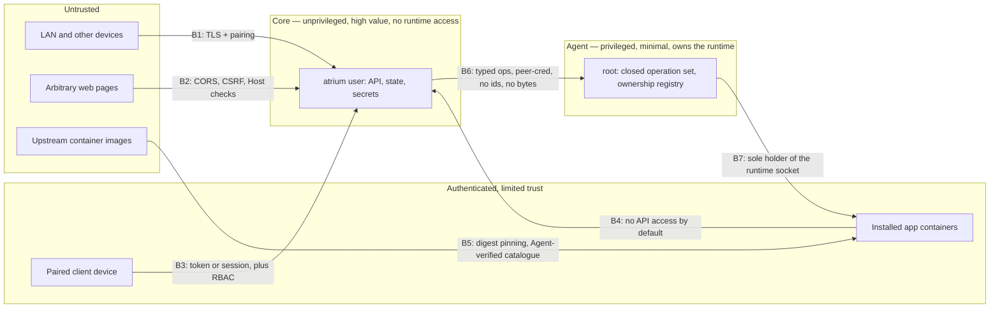

# Atrium — security model

Status: target design, revised in the hardening review of 2026-09-22. This
document is normative: a feature that cannot be built within these boundaries is
not built until the boundary is changed here first, with an ADR.

The prototype's security posture — narrow integrations, no shell, no Docker
socket exposure, origin-bound credentials, explicit local-TLS exceptions — is the
floor, not the ceiling. Nothing here relaxes it.

## 1. What is being protected

In priority order:

1. **The owner's data** on the server — media, documents, backups, application
   state. Loss and disclosure are both unacceptable.
2. **Control of the machine.** Atrium runs next to root. A compromise of Atrium
   that yields root yields the whole machine and everything else on it.
3. **The owner's credentials** — the pairing secret, device tokens, application
   secrets, and any third-party credentials the platform stores.
4. **Availability.** A home server that will not boot, or that locks its owner
   out, has failed even if nothing leaked.
5. **The supply chain.** What Atrium installs becomes what the owner runs.

## 2. Threat model

### Adversaries considered

| ID | Adversary | Capability |
| --- | --- | --- |
| T1 | **LAN attacker** | On the same network. Can scan, connect, spoof mDNS, ARP-poison, run a responder claiming to be Atrium, attempt to pair, and record a pairing exchange. |
| T2 | **Malicious web page** | Running in the owner's browser on a device that can reach the server. Can issue cross-origin requests, attempt DNS rebinding against the LAN address. |
| T3 | **Compromised client device** | Owner's laptop or phone is malware-infected. Holds a valid device token. |
| T4 | **Compromised application container** | An app Atrium installed is exploited, or its upstream image is backdoored. Has code execution inside a container on the server. |
| T5 | **Malicious or compromised catalogue/manifest** | A manifest requesting more capability than the app needs, or a legitimate manifest whose upstream image is hostile. |
| T6 | **Compromised Core** | Remote code execution in Core itself. Runs as `atrium`, not root, with no container-runtime access. Bounded in §4. |
| T7 | **Unprivileged local user** on the server | A second account on the machine. Can read world-readable files, connect to local sockets, attempt symlink races. |
| T8 | **Network attacker off-LAN** | Only relevant when remote access is enabled. Can reach whatever is exposed. |
| T9 | **Thief with physical access** | Has the disk. Everything at rest is readable unless the disk is encrypted, which Atrium does not control. |
| T10 | **Compromised Agent** | Code execution in Agent. Agent is root, so this is total compromise of the machine. There is no mitigation; the entire design is about making Agent small enough to review and hard enough to reach. |

### Explicitly out of scope

- A hostile root user on the server. Root already owns Atrium.
- A backdoored operating system, firmware or CPU.
- Targeted attackers with resources to attack the build toolchain of Rust or the
  container runtime.
- Protecting data at rest from physical theft (T9). Atrium states this honestly
  and recommends full-disk encryption rather than pretending to solve it.

## 3. Trust boundaries

| Boundary | Crossed by | Enforced with |
| --- | --- | --- |
| B1 | Anything on the network | TLS 1.2 floor for the API, **TLS 1.3 required for the pairing endpoints** (a baseline choice, not a channel-binding requirement — ADR-003 §4), SPKI pinning, rate-limited unauthenticated surface limited to `/pair/info`, `/pair/begin`, `/pair/complete` and `/healthz` |
| B2 | Browsers | Strict `Origin` checks, no wildcard CORS, `SameSite=Strict` cookies, CSRF tokens, `Host` header allowlist (DNS-rebinding defence) |
| B3 | Paired devices | Device token or session, per-device revocation, role checks on every route |
| B4 | App containers | Apps are on their own network and cannot reach Core's API; `permissions.atriumApi` is refused entirely in Alpha |
| B5 | Catalogue content | Index signature verified **by Agent against a compiled-in publisher key Core cannot supply or replace** (§18); manifests covered by digest in that verified index; images pinned by digest |
| B6 | Core to Agent | Unix socket `0660 root:atrium`, `SO_PEERCRED` uid check, closed typed operation enum, no container ids, no opaque byte payloads, Agent-side journal |
| B7 | Agent to runtime | Agent is the only holder of Atrium's runtime socket access. Core is not in the `docker` group and cannot open the socket. |

**The single most important property: crossing B6 must not be expressible as
"run this", "write these bytes there", or "act on this container id".** What
that buys is stated as an enforceable claim in §4.

## 4. The Core-compromise property

This is the claim the architecture exists to make true, stated precisely enough to
be tested rather than believed.

> **Claim.** An attacker with arbitrary code execution as the `atrium` user, able
> to issue any sequence of operations the Core-to-Agent protocol can express,
> cannot obtain execution as root on the host, cannot execute an arbitrary
> command or container image, and cannot mutate any container that Atrium did not
> itself create.

**What such an attacker *can* do**, stated without euphemism:

- read everything Core holds: the state database, every stored secret, every
  device token hash, application settings, the audit log
- deny service: stop every Atrium-managed app, refuse every request, corrupt
  Core's own data
- start, stop, restart, upgrade and uninstall **Atrium-managed apps**, including
  deleting their data
- install or upgrade any application **that exists in the signed catalogue**,
  which means running code inside an unprivileged container with no host mounts,
  no added capabilities, no devices and its own network
- write into application data directories under `/var/lib/atrium/appdata`, which
  can change how a catalogue application behaves inside its own container — Core
  already controls those applications, so this adds no authority, but it is worth
  stating rather than discovering
- reboot or shut down the machine, since that is a defined product operation
- lie to every client about all of the above

**What such an attacker cannot do, and why:**

| Cannot | Prevented by |
| --- | --- |
| Run an arbitrary command or script | No operation takes a command, argv or shell fragment (ADR-004) |
| Run an arbitrary container image | Agent verifies the catalogue index against its own publisher trust root and re-derives the spec from the manifest; a spec handed over by Core is not trusted (ADR-014, ADR-016) |
| Mount a host path, add a capability, map a device, use host networking, or run privileged | Agent refuses these in every spec it derives; Alpha manifests cannot express them at all (ADR-014) |
| Touch a container Atrium did not create | Agent's own ownership registry plus an owner token Core never sees; the protocol has no container-id parameter (ADR-013) |
| Open the container runtime socket | Core is not in the `docker` group; the socket is not readable by `atrium`; there is no proxy (ADR-013) |
| Write arbitrary bytes to a privileged file | No operation carries an opaque payload; privileged configuration is rendered by Agent from validated structures (ADR-004) |
| Install an arbitrary host package | No package operation exists in Alpha; later ones take a member of a compiled allowlist (ADR-004) |
| Erase the evidence | Agent's journal and ownership registry are root-only and unreadable to `atrium` |

**Residual, and deliberately so:** the attacker has all of Core's data, and can
run catalogue software. A container escape in the runtime, or a vulnerability in a
catalogue application, converts confinement into host access — which is why
rootless containers are the V1 end-state and why the catalogue is curated. This
claim is about the *architecture* not handing over root, not about the kernel
being perfect.

Acceptance tests that enforce the claim are in
[`ROADMAP.md`](ROADMAP.md#m1--acceptance-criteria) (M1, structural) and
[`ROADMAP.md`](ROADMAP.md#m2--container-boundary-acceptance-criteria) (M2,
behavioural).

## 5. Authentication

- **Devices** authenticate with an opaque 256-bit random token (`Authorization:
  Bearer`), held in the OS keychain client-side and stored server-side **only as
  `SHA-256(token)`**, compared in constant time. A password hash is deliberately
  not used: the token is 256 bits from the OS CSPRNG, so there is no guessing
  resistance to buy, and a slow verifier would add latency to every request plus a
  cache whose invalidation could outlive a revocation (ADR-003 §7).
- **Browsers** authenticate with an `HttpOnly; Secure; SameSite=Strict` session
  cookie plus a double-submit CSRF token. Session lifetime is bounded and
  refreshed on use.
- **Pairing** is a one-time, secret-based, channel-bound exchange — see §6 and
  ADR-003.
- There is no password login in Alpha, because there is no password to steal and
  no reset flow to abuse. Multi-user accounts (post-Alpha) introduce passwords
  with a real password hash — Argon2id — rate limiting, and optional TOTP. That is
  the case where a password hash earns its cost, because a human chose the secret.
- Failed authentication is constant-time compared and returns an identical
  response shape regardless of whether the device id existed.

## 6. Pairing security

The threats are T1 — someone on the LAN pairing with the owner's server,
impersonating the owner's server, or recording an exchange and attacking it
offline afterwards.

The construction, its transcript, its entropy requirement and every lifecycle rule
are specified in
[ADR-003](adr/0003-authentication-and-device-pairing.md). The properties it
provides:

1. **Knowledge of the pairing secret proves access to the machine.** It is printed
   on the server's console by the installer and re-issuable only by running
   `atriumctl pair` on the server. Core never transmits it.
2. **Channel binding.** Both proofs cover the server's SPKI hash, so a
   machine-in-the-middle presenting its own TLS key cannot relay a proof to the
   real server.
3. **Mutual confirmation.** The server proves knowledge of the same secret back to
   the client before the client stores anything, so a fake server is detected
   rather than trusted.
4. **Offline-attack resistance by entropy, not by rate limiting.** An active
   attacker can capture a client's proof and attack it offline, where a
   server-side rate limit is irrelevant. The secret is therefore **exactly 16
   random bytes — 128 bits — encoded as 26 Crockford Base32 symbols**, and it is
   copied or scanned rather than typed from memory. Display grouping carries no
   entropy; decoding is normalized and canonical, and comparison happens on the
   decoded bytes in constant time (ADR-003 §3). This is a high-entropy secret,
   **not a human PIN**: short typed codes are not offered until a reviewed PAKE is
   adopted, which ADR-003 states as a prerequisite rather than an aspiration.
5. **One-shot, expiring, rate-limited.** Single use; default 15-minute lifetime;
   five global failures disable pairing until re-armed on the server.
6. **Claim-on-first-pair with a bounded window**, so a LAN attacker cannot win a
   race against a freshly installed server without reading its console.
7. **The binding is explicit, and the browser is not a dead end.** The transcript
   names its binding profile, so the native profile (exporter plus SPKI) and a
   future browser profile can never be confused and cannot be downgraded into
   one another — a profile is armed at the console, never negotiated. Browser
   pairing is gated on the certificate decision in §14, because a browser with no
   trust anchor has nothing to bind to; ADR-003 §4a states this plainly rather
   than pretending page JavaScript can read TLS internals.
8. **Discovery is never trust.** An mDNS record is a hint. The SPKI pin is
   established during pairing and checked on every later connection; a mismatch is
   a hard failure with an explicit "this is not the server you paired with" state,
   never a "continue anyway" button.

## 7. Authorization

Roles, checked on every route, never inferred from the UI:

| Role | May |
| --- | --- |
| `owner` | everything, including device revocation, users, remote access, power, destructive operations |
| `admin` | everything except changing the owner and revoking the owner's devices |
| `operator` | start/stop/restart apps, view logs and diagnostics; no install, no uninstall, no system settings |
| `viewer` | read-only |

Rules:

- Authorization is enforced in Core, at the route, before any provider call or
  Agent operation. The client's role knowledge is for rendering only.
- Destructive operations (uninstall with data removal, power off, factory reset,
  storage changes) require a second confirmation carrying a short-lived,
  single-use confirmation token issued for that specific target — the prototype's
  typed-address confirmation, generalized.
- No role can obtain command execution. There is no "advanced" role that unlocks
  a shell.
- Agent does not implement roles. It trusts Core for *authorization* and for
  nothing else — not for ownership, not for spec contents, not for catalogue
  authenticity.

## 8. Secret storage

| Secret | Where | Protection |
| --- | --- | --- |
| TLS private key | `/etc/atrium/tls.key` | `0600 atrium:atrium`, never leaves the machine, never in a backup export |
| Device token digests | Core state DB | `SHA-256(token)`, constant-time comparison, no plaintext ever stored, deleted transactionally on revocation |
| Pairing secret | memory only, with a hashed record for attempt counting | never persisted in plaintext, never logged |
| App secrets (generated passwords, API keys) | secrets DB, encrypted with a key file at `/etc/atrium/secrets.key` (`0600`) | decrypted only when composing an install request; never returned by the API |
| Third-party credentials the owner stores | same | API returns `{ kind, exists }` only — the prototype's rule, kept |
| **Container owner tokens** | `/var/lib/atrium-agent/ownership.json` | `0600 root:root`; **never returned to Core**, never in any API response, never in diagnostics |
| Client-side device token | OS keychain | Windows Credential Manager / macOS Keychain / Secret Service |

Never: secrets in environment variables visible via `/proc/<pid>/environ` to other
local users (T7), in container labels other than the owner token (which is only
meaningful to Agent and is not a credential anywhere else), in logs, in
diagnostics bundles, in configuration exports, or in the repository.

Diagnostics bundles are redacted by construction — fields are allowlisted into the
bundle rather than blocklisted out of it.

## 9. Privilege separation

**The device identity private key is not writable by Core.** It is
`root:atrium 0640` in a `root:root 0750` directory, so discretionary access
control alone prevents the service identity from replacing it; the unit's
`ReadOnlyPaths` is defence in depth, not the mechanism. Arbitrary code execution
as `atrium` can read the key — it must, to serve TLS — but cannot rotate,
truncate or delete it, and cannot create a file beside it. Generation happens
once at install time in a separate short-lived invocation, and rotation is a
root-only console action.

**Core** — `User=atrium`, `NoNewPrivileges=true`, `ProtectSystem=strict`,
`ProtectHome=true`, `PrivateTmp=true`, `ReadWritePaths=/var/lib/atrium`,
`CapabilityBoundingSet=` (empty), `RestrictAddressFamilies=AF_INET AF_INET6
AF_UNIX AF_NETLINK`, `MemoryDenyWriteExecute=true`,
`SystemCallFilter=@system-service`, **`SupplementaryGroups=`** (empty — Core is in
no supplementary group, which is how "not in the `docker` group" is enforced by
configuration rather than by convention).

**Agent** — root, socket-activated, `NoNewPrivileges=true` (it needs no `sudo`
because it is already root — strictly better than the prototype's sudoers
arrangement, which had to leave `NoNewPrivileges=false`),
`ProtectHome=true`, `PrivateTmp=true`, `ReadWritePaths=/var/lib/atrium-agent
/var/lib/atrium/appdata`, and the narrowest address families its runtime adapter
needs.

Agent's network posture is adapter-dependent and is stated rather than assumed:

- With **Docker**, the daemon performs registry fetches, so Agent needs only
  `AF_UNIX` and runs with `PrivateNetwork=true`.
- With **Podman**, image fetching happens in-process, so `PrivateNetwork=true`
  cannot hold. That relaxation is a change to this document and needs its own
  review when the Podman adapter lands; it is not a quiet implementation detail.

**Container runtime access.** Agent holds it; Core does not have it in any form.
Not the group, not the socket, not a TCP endpoint, not a filtering proxy. A socket
proxy was considered and rejected: a proxy that is permissive enough to be useful
is a Docker API passthrough with extra steps, and a proxy narrow enough to be safe
is the typed operation protocol, which is what was built instead (ADR-013).

Rootless Podman remains the V1 end-state. Its benefit has changed shape: it no
longer protects Core, which already has no access, but it shrinks **Agent's** own
blast radius and the consequence of a container escape.

## 10. Application and container risk (T4, T5)

- Images are pinned by **digest**, not tag, in the resolved manifest. A catalogue
  update is an explicit, visible version change.
- **Agent verifies the catalogue signature against a publisher trust root Core
  cannot reach, and re-derives the container specification from the manifest.** A
  specification composed by Core is input, not instruction. This is what prevents
  a compromised Core from running an arbitrary image (ADR-014), and the key
  separation that makes it meaningful is §18 (ADR-016).
- Manifests declare **capabilities** — host paths, devices, host network,
  privileged mode, extra kernel capabilities, access to Atrium's own API. In Alpha
  **all of them are refused**: Agent rejects any spec containing them, and the
  manifest schema does not accept them. They return only with a grant mechanism
  Agent can verify without trusting Core — an owner action taken at the server
  console, not a flag in an API call.
- Default posture for an app container: `no-new-privileges`, all capabilities
  dropped, read-only root filesystem where the image supports it, its own bridge
  network, no access to Core's socket or API, and volumes drawn only from
  Agent-created named volumes and Agent-registered data roots.
- Containers run as a non-root user where the image supports it; where they do
  not, that is surfaced as a property of the app.
- An app cannot reach another app's data: volume sources are composed by Agent
  from the app's own identity, never supplied as absolute host paths.

## 11. Command execution risk

There is no command execution API. The following are permanently prohibited:

- an endpoint or operation that accepts a command, argv, script, or shell fragment
- an endpoint or operation that accepts a file path to execute
- an endpoint that proxies SSH
- an operation that accepts an arbitrary unit name, an arbitrary package name, a
  container id, or a path outside a compiled allowlist
- **an operation that accepts opaque bytes to be written to a privileged file** —
  privileged configuration is described as validated structures and rendered by
  Agent, because a configuration format is usually a programming language in
  disguise (Samba's `root preexec` being the canonical example)
- passing user input through a shell anywhere in any component

Where Atrium must invoke an external tool, it is: a fixed absolute executable
path, a fixed argument template, typed and validated parameters, no shell, an
explicit environment, a timeout, bounded output, and an audit entry. This is
exactly the prototype's `dispatch_power` pattern and it is the only pattern
permitted.

## 12. Audit logging

Every privileged operation, authentication event, pairing attempt, role change,
device revocation, app install/upgrade/uninstall, ownership mismatch, and
destructive confirmation produces an audit record:

`{ id, timestamp, actor(deviceId,userId,role), action, target, parameters(redacted), outcome, errorCode, correlationId }`

- Append-only, in Core's database, surfaced read-only at `GET /api/v1/audit`.
- Agent keeps its **own** journal of what it was asked to do and what it refused,
  in root-only storage (defence against T6). An `ownership_mismatch` or a refused
  spec is journaled by Agent whether or not Core records it.
- Retention is bounded by count and age, oldest discarded first. Audit never fills
  the disk.
- Failures are audited as loudly as successes. An operation with no outcome
  recorded is itself an auditable anomaly.

## 13. Rate limiting and denial of service

- Unauthenticated endpoints: strict per-IP token bucket, plus a global cap on
  concurrent unauthenticated connections. Pairing has its own global failure
  counter that disables the flow rather than merely slowing it.
- Authenticated endpoints: per-device limits; expensive operations (log tailing,
  diagnostics bundles, image pulls) are serialized per resource with a queue depth
  of one and a clear `busy` state.
- Agent applies its own limits independently of Core: one power action at a time,
  one image pull at a time, a bounded operation queue, and a bounded response
  size. A compromised Core cannot use Agent as an amplifier.
- Request body size, header count and header size are bounded before parsing, as
  the prototype's agent already does.
- Long-running operations never hold a request open: they return an operation id.
- Core's own resource use is bounded: metric history is a fixed-size ring, log
  reads are bounded and streamed, and no endpoint loads an unbounded provider
  result into memory.

## 14. Browser-specific concerns

- **CORS**: no wildcard. Only the origins Core itself serves are allowed. Native
  clients do not send `Origin` and are handled by token auth.
- **CSRF**: cookie sessions require a matching CSRF token on every unsafe method.
  Bearer-token requests are exempt because they cannot be sent ambiently by a
  browser.
- **DNS rebinding** (T2): Core validates the `Host` header against an allowlist of
  its own addresses, `atrium-<id>.local` and `localhost`. A request arriving with
  an attacker-controlled hostname is rejected before routing — the prototype agent
  already does exactly this and it is kept.
- **Clickjacking**: `X-Frame-Options: DENY` / `frame-ancestors 'none'` on the
  management UI. App web interfaces are separate origins and are not framed by the
  management UI without explicit configuration.
- **CSP** on the served UI: `default-src 'self'`, no inline script, no remote
  script or font origins. The prototype's Tauri CSP is the model.
- **Certificate reality (A-24)**: a self-signed certificate produces a browser
  warning. Alpha accepts this, documents it honestly, and never teaches the user
  to click through warnings as a habit. Candidate resolutions, decided before
  Beta: a locally installed Atrium CA, or an ACME certificate for a real name when
  the owner has one. Native clients are unaffected — they pin.

## 15. Remote access

Default: **off**. LAN only. Nothing listens outside the local network and no relay
exists.

When the owner enables remote access, the offered paths, in order of preference:

1. **The owner's own VPN.** Documented, zero code, safest. Atrium stays LAN-only.
2. **Atrium-managed WireGuard.** Core generates peer configuration and a QR code;
   the client joins a private tunnel. Still no service exposed publicly.
3. **Direct exposure.** Supported only with an explicit, repeated warning, a
   forced review of exposed surface, and mandatory hardening: a real certificate,
   stricter rate limits, and optional second factor.
4. **A hosted relay** is not built. If it ever is, it is opt-in, end-to-end
   encrypted, zero-knowledge of the content, and never required.

Remote access never widens the API. The same routes, the same roles, the same
audit. There is no "remote mode" that unlocks anything.

## 16. Update security

- Release artefacts are signed; the installer and the update path both verify the
  signature before anything is unpacked, and refuse on mismatch.
- Core and Agent are updated together and their protocol version is checked at
  startup. A Core that finds an incompatible Agent reports the container and
  privileged domains unavailable; it does not attempt another route.
- Updates are staged, not applied in place: download, verify, install alongside,
  switch, and keep the previous version for rollback.
- A failed update rolls back automatically. A Core that cannot start after an
  update rolls back on the next boot.
- Database migrations back up first and are transactional (ADR-012).
- Atrium does not auto-update by default in Alpha. When auto-update arrives it is
  opt-in, scheduled, and skippable.
- The update check contacts a release endpoint. This is the only outbound
  connection the platform makes on its own, it is disableable, and it sends no
  identifying information beyond a version string.

## 17. Supply chain

- Dependencies are pinned with lockfiles; both Rust and JavaScript lockfiles are
  committed, as they already are.
- CI runs `cargo audit` / `cargo deny` and a JavaScript advisory check on every
  change; a new advisory fails the build.
- Release builds are reproducible as far as the toolchain allows, built in CI from
  a tagged commit, with artefact checksums published.
- The application catalogue is a signed, versioned artefact, and **its signature is
  verified by Agent against its own trust root** as well as by Core (§18).
  Catalogue entries name upstream images by digest. Atrium does not build or host
  images in Alpha.
- Third-party container images are the largest residual supply-chain risk (T5) and
  the product says so plainly rather than implying it has audited them.

## 18. Trust roots and key separation

Three keys, three domains, no overlap in either direction. The full decision,
including the Alpha mechanism and the rotation story, is
[ADR-016](adr/0016-trust-roots-and-key-separation.md).

| Key | Where it lives | Proves | Must never |
| --- | --- | --- | --- |
| **Server device identity** | generated per server at first boot, `0600 atrium:atrium`, never leaves the machine | *which machine this is* — TLS, and the SPKI clients pin at pairing | sign a release, a catalogue or a manifest |
| **Release signing** | offline, publisher side; public half ships with the installer and the package repository | *that this binary is ours* — including the Agent binary itself | verify catalogue content, or take part in TLS |
| **Catalogue publisher** | offline, publisher side; public half **compiled into the Agent binary** | *that this application manifest is ours* | take any TLS or pairing role |

Why this matters concretely: if a server's identity key could vouch for software,
compromising one home server would let an attacker make **any** Atrium
installation accept their software as first-party. Identity and publication are
different questions and they get different keys.

Mechanism, in one paragraph: the catalogue ships as manifests plus an `index.json`
listing each manifest's SHA-256, plus a detached Ed25519 signature over that index.
Agent verifies the index signature against a compiled-in publisher key, then
requires the manifest it is about to use to match the digest in the verified index.
**Core cannot supply, name, add, remove or replace a trust root, and no operation
carries a key, a key path or a flag that relaxes verification.** Unsigned or
mis-signed content is refused with `agent.catalogue_signature_invalid` or
`agent.manifest_digest_mismatch`, neither of which has an override reachable from
the API.

A development escape hatch exists and is deliberately visible: an extra public key
installed at the server console into `/etc/atrium/agent/publisher-keys.d/`, or the
unsigned-local-manifest flag, both make Agent report
`catalogueTrust: "extended"` through the capability surface, and the interface
shows it. Reduced trust is a state the owner can see, never a silent setting.

Two limitations, stated rather than implied away: in Alpha the catalogue key is
rotated **by shipping a new Agent**, so its integrity reduces to the release
signing key's; and emergency revocation therefore requires a release. The signed
key-transition statement that removes both constraints is designed in ADR-016 and
is required before any remote or third-party catalogue exists.

## 19. Recovery and revocation

Every one of these must work without a terminal except where stated:

| Situation | Recovery |
| --- | --- |
| Client device lost or stolen | Revoke that device from any other paired client. Token dies immediately. |
| All clients lost | Run `atriumctl pair` on the server console to issue a new secret. This is the documented terminal exception. |
| Suspected compromise | "Revoke all devices" — invalidates every token and session, keeps data, requires re-pairing. |
| Server key compromise | Rotate identity key: reissues TLS, invalidates pins, forces re-pairing of every device. Deliberately heavyweight. |
| App shows `disowned` | Agent refused to act because ownership evidence did not match. The owner inspects the container and chooses to re-install or leave it alone. Atrium never re-claims it automatically. |
| Bad configuration | Configuration snapshots before every change; restore from the UI. |
| Failed update | Automatic rollback. |
| Corrupt database | Degraded recovery mode: `/healthz` and redacted diagnostics stay available so the owner can see what is wrong. **Restore itself is a local console action** (`atriumctl restore`), never a remote endpoint — see the note below. |
| Locked out entirely | Documented console reset that clears devices and pairing state without touching application data. |

Revocation is always immediate, never "on next token expiry".

**Catastrophic recovery is a deliberate exception to "no terminal required."**
When the primary state database is unreadable, the component that knows who is
allowed to do anything is exactly the component that is broken. The alternatives
are an unauthenticated remote restore, which hands a LAN attacker the ability to
roll a server back to an old state, or a second authentication store kept outside
the database, which is a duplicate of the most security-sensitive state in the
product and a consistency bug waiting to happen — a revocation could land in one
and not the other.

Neither is acceptable for the sake of avoiding a terminal on a day the machine is
already broken. So recovery mode **serves no state-changing route at all**: no
restore, no pairing, no device changes, no Agent call. It reports, and the owner
restores from the console with physical or administrative access to the machine.
This is the one place the product's own usability goal is knowingly traded for a
narrower attack surface, and it is written down here rather than discovered in
the code.

## 20. Known residual risks

Stated plainly, because the prototype's README set this standard:

1. **Agent is root (T10).** The whole design concentrates privilege in one small
   component so that it can be reviewed completely. A bug in Agent is a full host
   compromise. Agent's size is a security property and growing it is a security
   change.
2. **Container escape.** A compromised Core can run catalogue software in a
   confined container; a runtime or kernel escape turns that into host access.
   Rootless containers (V1) reduce this; they do not remove it.
3. **Core holds all the data.** Removing runtime access does not protect the
   state database or the secrets store. A Core compromise is still a total
   disclosure of everything the platform knows.
4. **Third-party container images are not audited by this project.**
5. **Self-signed TLS in a browser** trains users to accept warnings. Unresolved
   until the Beta decision in §14.
6. **Physical access to the disk defeats everything at rest.**
7. **No external security audit has been performed.** As with the prototype, this
   is disclosed rather than glossed over.

Two risks that appeared in the previous revision of this document are gone
because the architecture changed, not because they were talked away: Core's
membership of the `docker` group, and the equivalence of a Core compromise to a
host compromise.
